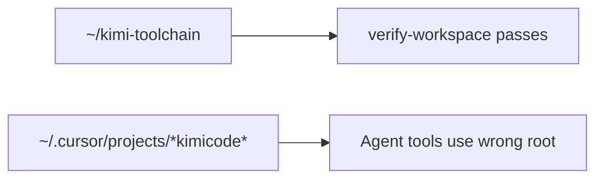

# Unified naming, paths, and development

> How **Kimi Code** (Moonshot agent), **kimi-toolchain** (this repo), **dx** (global Bun platform), and `~/.kimi-code/` fit together.

## Name matrix

| Name                               | What it is                                                                      | Canonical path                                            |
| ---------------------------------- | ------------------------------------------------------------------------------- | --------------------------------------------------------- |
| **Kimi Work**                      | Desktop knowledge-work agent (WebBridge, cron, local mounts)                    | `Kimi.app`, `~/Library/Application Support/kimi-desktop/` |
| **Kimi Code**                      | Moonshot terminal coding agent (Node/TypeScript, single-binary SEA)             | `~/.kimi-code/bin/kimi`                                   |
| **kimi-toolchain**                 | Bun-native dev-tools package (this repo)                                        | `~/kimi-toolchain/` (clone path)                          |
| **~/.kimi-code/**                  | Shared runtime home for Kimi Code + toolchain extensions                        | `~/.kimi-code/`                                           |
| **dx**                             | Global Bun dev/audit platform (separate codebase)                               | `~/.local/bin/dx`, `~/.config/dx/`                        |
| **kimi doctor** vs **kimi-doctor** | `kimi doctor` = official Kimi Code config; `kimi-doctor` = toolchain aggregator | Different commands                                        |

**Do not rename** `~/.kimi-code/` — it is the official Kimi Code data directory.

## Directory layout

```
~/.kimi-code/                          # Official Kimi Code home (Moonshot) — DO NOT hand-edit
├── bin/kimi                           # Kimi Code CLI (Node SEA, v0.11+)
├── config.toml                        # Agent: models, permissions, providers
├── tui.toml                           # UI: theme, notifications, auto_upgrade
├── credentials/                       # OAuth (managed:kimi-code)
├── sessions/wd_*/                     # Kimi Code chat sessions (workDir-bound)
├── session_index.jsonl                # Session index (cwd binding)
├── mcp.json                           # User-level MCP (toolchain seeds unified-shell + cloudflare-api)
├── config.toml                        # Agent: models, permissions, providers, [[hooks]]
├── plugins/                           # Kimi Code plugins
├── skills/                            # User skills (toolchain syncs kimi-toolchain skill)
├── logs/                              # Diagnostic logs
│
├── tools/*.ts                         # EXTENSION: synced from kimi-toolchain src/bin/
├── lib/*.ts                           # EXTENSION: synced from kimi-toolchain src/lib/
├── kimi-hooks/*.ts                    # EXTENSION: Kimi Code lifecycle hooks
├── scripts/*.ts                       # EXTENSION: synced gate scripts
├── var/sessions.db                    # EXTENSION: toolchain memory (not Kimi sessions)
├── var/tool-failures.jsonl            # EXTENSION: classified tool failure ledger
├── error-taxonomy.yml                 # EXTENSION: failure classification schema
├── governor/                          # EXTENSION: resource governor
├── guardian/                          # EXTENSION: lockfile security
├── toolchain-manifest.json            # EXTENSION: sync metadata
├── AGENTS.md, UNIFIED.md              # EXTENSION: copied from repo

~/kimi-toolchain/                      # Source of truth (this repo)
├── .kimi-code/mcp.json                # Optional project MCP overrides
├── src/bin/kimi-*.ts                  # Edit here
└── scripts/sync-to-desktop.ts         # Repo → ~/.kimi-code/

~/.local/bin/kimi-*                    # Thin wrappers → ~/.kimi-code/tools/*.ts
~/.agents/skills/kimi-toolchain/       # Cursor/Codex skill copy
~/.config/dx/                          # dx global config
```

**Agents: do not edit** `sessions/`, `credentials/`, or `config.toml` from toolchain code. Use `kimi doctor`, `/mcp-config`, or user-approved edits.

## Hook taxonomy

Three independent hook systems are used. Do not conflate naming in docs or code.

| System                        | Config / location                                                         | Trigger                  | Examples                                                                        |
| ----------------------------- | ------------------------------------------------------------------------- | ------------------------ | ------------------------------------------------------------------------------- |
| **Git hooks**                 | `.git/hooks/` (installed by `kimi-githooks`)                              | `git commit`, `git push` | `pre-commit` (format/lint/typecheck), `pre-push` (guardian + R-Score + sync)    |
| **Bun package hook**          | `package.json` `scripts.postinstall` → `src/install-hooks/postinstall.ts` | `bun install`            | Set up `~/.kimi-code/` layout, sync tools, init `sessions.db`                   |
| **Kimi Code lifecycle hooks** | `~/.kimi-code/config.toml` `[[hooks]]` → scripts in `src/kimi-hooks/`     | Agent tool lifecycle     | `PostToolUseFailure` → classify + log to `~/.kimi-code/var/tool-failures.jsonl` |

See official docs: https://moonshotai.github.io/kimi-code/en/customization/hooks.html

## Install Kimi Code (official)

Recommended — single binary, Node bundled inside:

```bash
curl -fsSL https://code.kimi.com/kimi-code/install.sh | bash
kimi --version
kimi doctor
```

Docs: https://moonshotai.github.io/kimi-code/en/guides/getting-started

Alternative: `npm install -g @moonshot-ai/kimi-code` (Node ≥ 24.15).

## Install kimi-toolchain (this repo)

```bash
git clone https://github.com/brendadeeznuts1111/kimi-toolchain.git ~/kimi-toolchain
cd ~/kimi-toolchain
bun install
bun install -g .                    # global link + postinstall → ~/.kimi-code/
bash scripts/install-bin-wrappers.sh
```

## Greenfield project

```bash
kimi-new my-app              # or: mkdir my-app && cd my-app && bun init -y && kimi-fix .
cd my-app
bun run check:fast
kimi login
kimi-doctor --quick
```

`kimi-fix` uses `package.json` `name` for `AGENTS.md`. Project `.kimi-code/mcp.json` is a stub; user-level `~/.kimi-code/mcp.json` provides `unified-shell` and `cloudflare-api` after `bun run sync` or `bun run unify`.

## Development loop

```bash
cd ~/kimi-toolchain

# 1. Edit source
#    src/bin/*.ts  src/lib/*.ts

# 2. Test from repo (fastest)
bun run check:fast          # unit tests @ 100ms (~1s total gate)
bun run check:dry-run       # preview format/lint/typecheck/test steps
bun test                    # full suite (unit + smoke)
bun run doctor --quick

# 3. Push to live runtime
bun run sync

# 4. Verify PATH commands match
kimi-doctor --quick
```

Optional during active toolchain work: `bun run sync:daemon` (every 5 min).

**Rule:** never hand-edit `~/.kimi-code/tools/` — always sync from repo.

## Command routing

| You type         | Resolves to                                                      | Runs                                |
| ---------------- | ---------------------------------------------------------------- | ----------------------------------- |
| `kimi`           | `~/.kimi-code/bin/kimi`                                          | Kimi Code agent TUI                 |
| `kimi doctor`    | same binary                                                      | Official config validator           |
| `kimi-doctor`    | `~/.local/bin/kimi-doctor` → `~/.kimi-code/tools/kimi-doctor.ts` | Toolchain diagnostics               |
| `bun run doctor` | repo `src/bin/kimi-doctor.ts`                                    | Same logic, reads repo package.json |
| `dx config`      | `~/.local/bin/dx`                                                | Machine-wide Bun/DX audit           |

## dx vs kimi-toolchain

| Tool                                              | Scope                                                |
| ------------------------------------------------- | ---------------------------------------------------- |
| `kimi-doctor`, `kimi-guardian`, `kimi-governance` | Project + `~/.kimi-code/` health                     |
| `dx setup`, `dx config`, `dx remediate`           | Machine-wide Bun environment                         |
| `dx.config.toml` in repo                          | Project policy (`containers = "none"`, `memoryGate`) |

## Legacy cleanup

| Path                        | Action                                       |
| --------------------------- | -------------------------------------------- |
| `~/.kimi/`                  | Deprecated — run `kimi migrate`, then remove |
| `~/.kimi-code/bin/kimi.bak` | Safe to delete after upgrade                 |
| `kimicode-cli` folder name  | Done — clone path is `~/kimi-toolchain`      |

## Unify checklist

Required after every clone or toolchain pull:

```bash
cd ~/kimi-toolchain
bun run unify                         # sync + wrappers + doctor + check
```

Or step-by-step:

```bash
cd ~/kimi-toolchain
kimi migrate                          # if ~/.kimi exists
bun run sync                          # repo → ~/.kimi-code/ (+ scripts/)
bash scripts/install-bin-wrappers.sh
kimi doctor                           # Kimi Code config
kimi-doctor --quick                   # toolchain + sync drift + memory
bun run memory-check                  # pre-session gate
```

`kimi-doctor --json` emits structured output for agents. `kimi-doctor --fix` runs `sync`, MCP provisioning, and wrapper install when drift is detected.

## MCP (Model Context Protocol)

Docs: https://moonshotai.github.io/kimi-code/en/customization/mcp.html

| Level   | Path                              | Precedence                 |
| ------- | --------------------------------- | -------------------------- |
| User    | `~/.kimi-code/mcp.json`           | Default for all projects   |
| Project | `.kimi-code/mcp.json` in repo cwd | Overrides same server name |

Toolchain auto-registers **unified-shell** (stdio → `unified-shell-bridge.ts`). Tool name in Kimi: `mcp__unified-shell__execute`.

```bash
bun run sync                    # refreshes bridge + mcp.json entry
kimi-doctor --quick             # MCP section validates wiring
```

In Kimi TUI: `/mcp` (status), `/mcp-config` (interactive edit). Permission rules: `templates/kimi-config-permissions.toml`.

## Editor workflows

### Terminal (Kimi Code TUI)

```bash
cd ~/kimi-toolchain
kimi              # new session for this workDir
kimi --continue   # resume previous session for this directory
```

### Cursor

- Open folder: `~/kimi-toolchain` (not legacy `kimicode-cli`)
- Or open workspace file: `~/kimi-toolchain/kimi-toolchain.code-workspace`
- If tools fail with `Path does not exist: .../kimicode-cli`, you opened the wrong path — see `AGENTS.md` Workspace section
- **Composer** uses Cursor's agent (separate from Kimi MCP)
- Integrated terminal `kimi` shares `~/.kimi-code/mcp.json`
- Toolchain: `kimi-doctor`, `bun run check`

### Zed / JetBrains (ACP)

Kimi Code speaks [Agent Client Protocol](https://moonshotai.github.io/kimi-code/en/reference/kimi-acp.html) via `kimi acp`. Use **absolute path** to `kimi`:

```json
{
  "agent_servers": {
    "Kimi Code CLI": {
      "type": "custom",
      "command": "/Users/you/.kimi-code/bin/kimi",
      "args": ["acp"],
      "env": {}
    }
  }
}
```

Run `kimi login` once in terminal before IDE ACP sessions.

## Agent session health

Cursor binds the workspace root at folder-open time. If the editor still points at `~/kimicode-cli` (removed/renamed), agent Grep/Glob fail even when shell `pwd` is `~/kimi-toolchain`.



**Recovery:**

1. File → Open Workspace → `~/kimi-toolchain/kimi-toolchain.code-workspace`
2. `bun run unify` (verify → sync → wrappers → doctor → check)
3. `kimi-doctor --fix --fix-cursor` if legacy Cursor slug remains, then restart Cursor

**CLI:** `kimi-toolchain workspace verify` (blockers), `kimi-toolchain doctor --ecosystem` (full map), `kimi-toolchain doctor --fix --fix-cursor` (opt-in slug removal). Legacy `kimi-doctor` etc. dispatch through `kimi-toolchain`.

## Kimi Code features (0.11.0)

| Feature                 | How                                                                            |
| ----------------------- | ------------------------------------------------------------------------------ |
| Official config check   | `kimi doctor`                                                                  |
| Config only             | `kimi doctor config [path]`                                                    |
| TUI only                | `kimi doctor tui [path]`                                                       |
| Goal queue              | `/goal next`, `/goal next manage`                                              |
| MCP                     | `/mcp`, `/mcp-config`                                                          |
| Subagents               | built-in `coder`, `explore`, `plan`                                            |
| Experimental sub-skills | `KIMI_CODE_EXPERIMENTAL_SUB_SKILL=1`                                           |
| Reload config           | `/reload`, `/reload-tui`                                                       |
| CLI flags               | `--continue`, `--session`, `--model`, `--yolo`, `--auto`, `--plan`, `--prompt` |

## Official Kimi Code Documentation

The following URLs are the authoritative source for Kimi Code CLI behavior. Cache or reference them when making toolchain decisions that depend on Kimi Code internals.

| Topic                                                           | Official URL                                                                        | Cached locally?        |
| --------------------------------------------------------------- | ----------------------------------------------------------------------------------- | ---------------------- |
| Config files (incl. `loop_control`, `permission`, `background`) | `https://moonshotai.github.io/kimi-code/en/configuration/config-files.html`         | No — fetch when needed |
| Providers & models                                              | `https://moonshotai.github.io/kimi-code/en/configuration/providers-and-models.html` | No                     |
| MCP servers                                                     | `https://moonshotai.github.io/kimi-code/en/customization/mcp.html`                  | No                     |
| ACP (IDE integration)                                           | `https://moonshotai.github.io/kimi-code/en/reference/kimi-acp.html`                 | No                     |
| `kimi` command reference                                        | `https://moonshotai.github.io/kimi-code/en/reference/kimi-command.html`             | No                     |
| GitHub repo (source)                                            | `https://github.com/MoonshotAI/kimi-code`                                           | No                     |

**Environment overrides** (take priority over `config.toml`):

| Variable                                  | Overrides                       | Example               |
| ----------------------------------------- | ------------------------------- | --------------------- |
| `KIMI_CODE_BACKGROUND_KEEP_ALIVE_ON_EXIT` | `background.keep_alive_on_exit` | `true`                |
| `KIMI_MODEL_PROVIDER`                     | Temporary model provider        | `anthropic`           |
| `KIMI_MODEL_MODEL`                        | Temporary model identifier      | `claude-4-7-20251014` |
| `KIMI_CODE_EXPERIMENTAL_SUB_SKILL`        | Experimental sub-skills         | `1`                   |

**Key config tables for agents** (from official docs, as of 2026-06-12):

### `loop_control`

| Field                   | Type      | Default | Description                                                                                   |
| ----------------------- | --------- | ------- | --------------------------------------------------------------------------------------------- |
| `max_steps_per_turn`    | `integer` | —       | Maximum steps per turn; unset or `0` means unlimited                                          |
| `max_retries_per_step`  | `integer` | `3`     | Maximum retries after a step failure                                                          |
| `reserved_context_size` | `integer` | —       | Tokens reserved for model output; compaction triggers when remaining context falls below this |

### `permission`

Rules are matched in order — first match wins. `scope` defaults to `user`.

```toml
[[permission.rules]]
decision = "allow"
pattern = "Read"

[[permission.rules]]
decision = "deny"
pattern = "Bash(rm -rf*)"
```

### `background`

| Field                | Type      | Default | Description                             |
| -------------------- | --------- | ------- | --------------------------------------- |
| `max_running_tasks`  | `integer` | —       | Max concurrent background tasks         |
| `keep_alive_on_exit` | `boolean` | `false` | Keep tasks running after session closes |

**Environment override:** `KIMI_CODE_BACKGROUND_KEEP_ALIVE_ON_EXIT` takes priority over `config.toml`.

**Note:** MCP server declarations belong in `~/.kimi-code/mcp.json` (or project-local `.kimi-code/mcp.json`), NOT in `config.toml`. The `[mcp]` section in some configs may be legacy or non-standard.

### Non-standard fields in our config (audit 2026-06-12)

Our `~/.kimi-code/config.toml` previously contained fields not documented in the official Kimi Code docs. They have been commented out and replaced with standard equivalents where possible:

| Non-standard field                  | Location         | Standard replacement                                                  | Risk                                      |
| ----------------------------------- | ---------------- | --------------------------------------------------------------------- | ----------------------------------------- |
| `[mcp] allow`                       | `config.toml`    | `[[permission.rules]]` with `pattern = "mcp__unified-shell__execute"` | Silently ignored; permissions don't apply |
| `[mcp.client] tool_call_timeout_ms` | `config.toml`    | None — use `permission.rules` + manual approval                       | Silently ignored                          |
| `[safety] auto_approve_destructive` | `config.toml`    | `default_permission_mode = "manual"` + `permission.rules`             | Silently ignored                          |
| `max_ralph_iterations`              | `[loop_control]` | None — remove if not used by toolchain code                           | May be ignored or cause warnings          |

**Rule:** When adding toolchain-specific config, prefer a separate file (e.g., `~/.kimi-code/governor/defaults.toml`, `~/.kimi-code/toolchain-manifest.json`) rather than polluting `config.toml` which Kimi Code owns.

### MCP servers (toolchain)

Our default `~/.kimi-code/mcp.json` registers `unified-shell` plus `cloudflare-api`. Other official Cloudflare MCP endpoints can be added explicitly when a project needs docs, bindings, builds, or observability tools. Per the official docs:

> "Only connect to servers from trusted sources."

| Server           | Type  | URL                              | Provisioned by default | Trust basis                         |
| ---------------- | ----- | -------------------------------- | ---------------------- | ----------------------------------- |
| `unified-shell`  | stdio | Local Bun script                 | Yes                    | First-party toolchain code          |
| `cloudflare-api` | HTTP  | `https://mcp.cloudflare.com/mcp` | Yes                    | Official Cloudflare MCP (Code Mode) |

Optional Cloudflare MCP endpoints, all under Cloudflare-controlled domains:

| Server                     | Type | URL                                            | Use when                                  |
| -------------------------- | ---- | ---------------------------------------------- | ----------------------------------------- |
| `cloudflare`               | HTTP | `https://mcp.cloudflare.com/mcp`               | General Cloudflare account/resource tools |
| `cloudflare-docs`          | HTTP | `https://docs.mcp.cloudflare.com/mcp`          | Current Cloudflare documentation          |
| `cloudflare-bindings`      | HTTP | `https://bindings.mcp.cloudflare.com/mcp`      | Worker binding discovery                  |
| `cloudflare-builds`        | HTTP | `https://builds.mcp.cloudflare.com/mcp`        | Build/deploy workflows                    |
| `cloudflare-observability` | HTTP | `https://observability.mcp.cloudflare.com/mcp` | Logs, traces, and runtime observability   |

Cloudflare MCP SSO/OAuth, Wrangler OAuth, and `kimi-cloudflare-access` API tokens are separate auth paths. Do not assume one login satisfies the others.

### `thinking`

| Field    | Type     | Default | Description                                              |
| -------- | -------- | ------- | -------------------------------------------------------- |
| `mode`   | `string` | —       | `auto` (model decides), `on` (always), `off` (force off) |
| `effort` | `string` | `high`  | `low`, `medium`, `high`, `xhigh`, `max`                  |

### `experimental`

| Field              | Type      | Default | Description                                           |
| ------------------ | --------- | ------- | ----------------------------------------------------- |
| `micro_compaction` | `boolean` | `true`  | Trim older large tool results while preserving recent |
