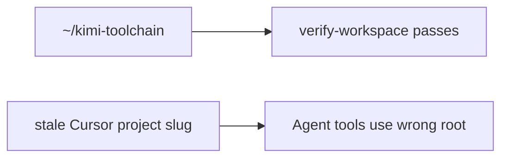

# Unified naming, paths, and development

> How **Kimi Code** (Moonshot agent), **kimi-toolchain** (this repo), **dx** (global Bun platform), and `~/.kimi-code/` fit together.

## Name matrix

| Name                               | What it is                                                                      | Canonical path                                            |
| ---------------------------------- | ------------------------------------------------------------------------------- | --------------------------------------------------------- |
| **Kimi Work**                      | Desktop knowledge-work agent (WebBridge, cron, local mounts)                    | `Kimi.app`, `~/Library/Application Support/kimi-desktop/` |
| **Kimi Code**                      | Moonshot terminal coding agent (Node/TypeScript, single-binary SEA)             | `~/.kimi-code/bin/kimi`                                   |
| **kimi-toolchain**                 | Bun-native dev-tools package (this repo)                                        | `~/kimi-toolchain/` (clone path)                          |
| **~/.kimi-code/**                  | Shared runtime home for Kimi Code + toolchain extensions                        | `~/.kimi-code/`                                           |
| **dx**                             | Global Bun dev/audit platform (separate codebase)                               | `~/.local/bin/dx`, `~/.config/dx/`                        |
| **kimi doctor** vs **kimi-doctor** | `kimi doctor` = official Kimi Code config; `kimi-doctor` = toolchain aggregator | Different commands                                        |

**Do not rename** `~/.kimi-code/` — it is the official Kimi Code data directory.

**Canonical links** (Bun, Effect, Kimi Code, Herdr, Cloudflare, DX): `canonical-references.json` in repo and `~/.kimi-code/` after sync. Source: `src/lib/canonical-references.ts`; `package.json` → `kimi.canonicalReferences`.

## Directory layout

```
~/.kimi-code/                          # Official Kimi Code home (Moonshot) — DO NOT hand-edit
├── bin/kimi                           # Kimi Code CLI (Node SEA, v0.11+)
├── config.toml                        # Agent: models, permissions, providers
├── tui.toml                           # UI: theme, notifications, auto_upgrade
├── credentials/                       # OAuth (managed:kimi-code)
├── sessions/wd_*/                     # Kimi Code chat sessions (workDir-bound)
├── session_index.jsonl                # Session index (cwd binding)
├── mcp.json                           # User-level MCP (toolchain seeds unified-shell + cloudflare-api)
├── plugins/                           # Kimi Code plugins
├── skills/                            # User skills (toolchain syncs kimi-toolchain skill)
├── logs/                              # Diagnostic logs
│
├── tools/*.ts                         # EXTENSION: synced from kimi-toolchain src/bin/
├── lib/*.ts                           # EXTENSION: synced from kimi-toolchain src/lib/
├── kimi-hooks/*.ts                    # EXTENSION: Kimi Code lifecycle hooks
├── scripts/*.ts                       # EXTENSION: synced gate scripts
├── var/sessions.db                    # EXTENSION: toolchain memory (not Kimi sessions)
├── var/tool-failures.jsonl            # EXTENSION: classified tool failure ledger
├── error-taxonomy.yml                 # EXTENSION: failure classification schema
├── governor/                          # EXTENSION: resource governor
├── guardian/                          # EXTENSION: lockfile security
├── toolchain-manifest.json            # EXTENSION: sync metadata
├── AGENTS.md, UNIFIED.md              # EXTENSION: copied from repo

~/kimi-toolchain/                      # Source of truth (this repo)
├── .kimi-code/mcp.json                # Optional project MCP overrides
├── src/bin/kimi-*.ts                  # Edit here
└── scripts/sync-to-desktop.ts         # Repo → ~/.kimi-code/

~/.local/bin/kimi-*                    # Thin wrappers → ~/.kimi-code/tools/*.ts
~/.agents/skills/kimi-toolchain/       # Cursor/Codex skill copy
~/.config/dx/                          # dx global config
```

**Agents: do not edit** `sessions/`, `credentials/`, or `config.toml` from toolchain code. Use `kimi doctor`, `/mcp-config`, or user-approved edits.

## Hook taxonomy

Three independent hook systems are used. Do not conflate naming in docs or code.

| System                        | Config / location                                                         | Trigger                  | Examples                                                                        |
| ----------------------------- | ------------------------------------------------------------------------- | ------------------------ | ------------------------------------------------------------------------------- |
| **Git hooks**                 | `.git/hooks/` (installed by `kimi-githooks`)                              | `git commit`, `git push` | `pre-commit` (format/lint/typecheck), `pre-push` (guardian + R-Score + sync)    |
| **Bun package hook**          | `package.json` `scripts.postinstall` → `src/install-hooks/postinstall.ts` | `bun install`            | Set up `~/.kimi-code/` layout, sync tools, init `sessions.db`                   |
| **Kimi Code lifecycle hooks** | `~/.kimi-code/config.toml` `[[hooks]]` → scripts in `src/kimi-hooks/`     | Agent tool lifecycle     | `PostToolUseFailure` → classify + log to `~/.kimi-code/var/tool-failures.jsonl` |

See official docs: https://moonshotai.github.io/kimi-code/en/customization/hooks.html

## Install Kimi Code (official)

Recommended — single binary, Node bundled inside:

```bash
curl -fsSL https://code.kimi.com/kimi-code/install.sh | bash
kimi --version
kimi doctor
```

Docs: https://moonshotai.github.io/kimi-code/en/guides/getting-started

Alternative: `npm install -g @moonshot-ai/kimi-code` (Node ≥ 24.15).

## Install kimi-toolchain (this repo)

```bash
git clone https://github.com/brendadeeznuts1111/kimi-toolchain.git ~/kimi-toolchain
cd ~/kimi-toolchain
bun install
bun install -g .                    # global link + postinstall → ~/.kimi-code/
bash scripts/install-bin-wrappers.sh
```

## Greenfield project

```bash
kimi-new my-app              # or: mkdir my-app && cd my-app && bun init -y && kimi-fix .
cd my-app
bun run check:fast
kimi login
kimi-doctor --quick
```

`kimi-fix` uses `package.json` `name` for `AGENTS.md`. Project `.kimi-code/mcp.json` is a stub; user-level `~/.kimi-code/mcp.json` provides `unified-shell` and `cloudflare-api` after `bun run sync` or `bun run unify`.

## Development loop

```bash
cd ~/kimi-toolchain

# 1. Edit source
#    src/bin/*.ts  src/lib/*.ts

# 2. Test from repo (fastest)
bun run check:fast          # unit tests @ 1500ms (~2-3s total gate)
bun run check:dry-run       # preview format/lint/typecheck/test steps
bun test                    # full suite (unit + smoke)
bun run doctor --quick

# 3. Push to live runtime
bun run sync
# Final handoff after tools/docs/skills/templates changed:
bun run sync && bun run sync:verify

# 4. Verify PATH commands match
kimi-doctor --quick
```

Optional during active toolchain work: `bun run sync:daemon` (every 5 min).

**Rule:** never hand-edit `~/.kimi-code/tools/` — always sync from repo, then
verify with `bun run sync:verify`.

## Command routing

| You type         | Resolves to                                                      | Runs                                |
| ---------------- | ---------------------------------------------------------------- | ----------------------------------- |
| `kimi`           | `~/.kimi-code/bin/kimi`                                          | Kimi Code agent TUI                 |
| `kimi doctor`    | same binary                                                      | Official config validator           |
| `kimi-doctor`    | `~/.local/bin/kimi-doctor` → `~/.kimi-code/tools/kimi-doctor.ts` | Toolchain diagnostics               |
| `bun run doctor` | repo `src/bin/kimi-doctor.ts`                                    | Same logic, reads repo package.json |
| `dx config`      | `~/.local/bin/dx`                                                | Machine-wide Bun/DX audit           |

## dx vs kimi-toolchain

| Tool                                              | Scope                                                |
| ------------------------------------------------- | ---------------------------------------------------- |
| `kimi-doctor`, `kimi-guardian`, `kimi-governance` | Project + `~/.kimi-code/` health                     |
| `dx setup`, `dx config`, `dx remediate`           | Machine-wide Bun environment                         |
| `dx.config.toml` in repo                          | Project policy (`containers = "none"`, `memoryGate`) |

## Legacy cleanup

| Path                        | Action                                       |
| --------------------------- | -------------------------------------------- |
| `~/.kimi/`                  | Deprecated — run `kimi migrate`, then remove |
| `~/.kimi-code/bin/kimi.bak` | Safe to delete after upgrade                 |
| Old clone folder names      | Done — clone path is `~/kimi-toolchain`      |

## Unify checklist

Required after every clone or toolchain pull:

```bash
cd ~/kimi-toolchain
bun run unify                         # sync + wrappers + doctor + check
```

Or step-by-step:

```bash
cd ~/kimi-toolchain
kimi migrate                          # if ~/.kimi exists
bun run sync                          # repo → ~/.kimi-code/ (+ scripts/)
bun run sync:verify                   # verify runtime manifest + source hashes
bash scripts/install-bin-wrappers.sh
kimi doctor                           # Kimi Code config
kimi-doctor --quick                   # toolchain + sync drift + memory
bun run memory-check                  # pre-session gate
```

`scripts/sync-to-desktop.ts` writes `toolchain-manifest.json` with the
toolchain version, repo HEAD, sync timestamp, changed files, and source hashes.
`bun run sync:verify` checks repo-managed runtime files against the synced
hashes. `kimi-doctor --json` emits structured output for agents.
`kimi-doctor --fix` runs `sync`, MCP provisioning, and wrapper install when
drift is detected.

## MCP (Model Context Protocol)

Docs: https://moonshotai.github.io/kimi-code/en/customization/mcp.html

| Level   | Path                              | Precedence                 |
| ------- | --------------------------------- | -------------------------- |
| User    | `~/.kimi-code/mcp.json`           | Default for all projects   |
| Project | `.kimi-code/mcp.json` in repo cwd | Overrides same server name |

Toolchain auto-registers **unified-shell** (stdio → `unified-shell-bridge.ts`). Tool name in Kimi: `mcp__unified-shell__execute`.

```bash
bun run sync                    # refreshes bridge + mcp.json entry
kimi-doctor --quick             # MCP section validates wiring
```

In Kimi TUI: `/mcp` (status), `/mcp-config` (interactive edit). Permission rules: `templates/kimi-config-permissions.toml`.

## Editor workflows

### Terminal (Kimi Code TUI)

```bash
cd ~/kimi-toolchain
kimi              # new session for this workDir
kimi --continue   # resume previous session for this directory
```

### Cursor

- Open folder: `~/kimi-toolchain`
- Or open workspace file: `~/kimi-toolchain/kimi-toolchain.code-workspace`
- If tools fail with a path under an old renamed clone, you opened the wrong path — see `AGENTS.md` Workspace section
- **Composer** uses Cursor's agent (separate from Kimi MCP)
- Integrated terminal `kimi` shares `~/.kimi-code/mcp.json`
- Toolchain: `kimi-doctor`, `bun run check`

### Zed / JetBrains (ACP)

Kimi Code speaks [Agent Client Protocol](https://moonshotai.github.io/kimi-code/en/reference/kimi-acp.html) via `kimi acp`. Use **absolute path** to `kimi`:

```json
{
  "agent_servers": {
    "Kimi Code CLI": {
      "type": "custom",
      "command": "/Users/you/.kimi-code/bin/kimi",
      "args": ["acp"],
      "env": {}
    }
  }
}
```

Run `kimi login` once in terminal before IDE ACP sessions.

## Agent session health

Cursor binds the workspace root at folder-open time. If the editor still points at an old renamed clone, agent Grep/Glob fail even when shell `pwd` is `~/kimi-toolchain`.



**Recovery:**

1. File → Open Workspace → `~/kimi-toolchain/kimi-toolchain.code-workspace`
2. `bun run unify` (verify → sync → wrappers → doctor → check)
3. `kimi-doctor --fix --fix-cursor` if legacy Cursor slug remains, then restart Cursor

**CLI:** `kimi-toolchain workspace verify` (blockers), `kimi-toolchain doctor --ecosystem` (full map), `kimi-toolchain doctor --fix --fix-cursor` (opt-in slug removal). Legacy `kimi-doctor` etc. dispatch through `kimi-toolchain`.

## Kimi Code reference

CLI flags, slash commands, subcommands, config defaults, non-standard field audit, and official doc URLs: **`skills/kimi-toolchain/SKILL.md`**.

Default MCP inventory (`unified-shell`, `cloudflare-api`, optional Cloudflare endpoints) and auth separation (SSO vs Wrangler vs `kimi-cloudflare-access` tokens): see the MCP section above and [CODE_REFERENCES.md](CODE_REFERENCES.md).

**Rule:** Never add toolchain-specific keys to `config.toml`. Use `~/.kimi-code/toolchain-manifest.json`, `~/.kimi-code/governor/defaults.toml`, or project files under `~/.kimi-code/` instead.
