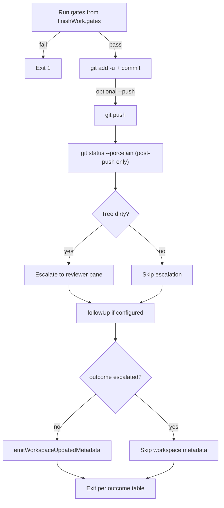

# Finish-work close-loop architecture

**Status:** production-validated (2026-06-16)  
**Scope:** `finish-work` pipeline inside a Herdr project workspace  
**Config:** `dx.config.toml` → `[finishWork]`, `[herdr]`, `[herdr.orchestrator]`

---

## Purpose

`finish-work` is the agent close-loop for kimi-toolchain: run quality gates, commit/push, detect a dirty post-push tree, escalate to a human reviewer pane, and signal the orchestrator so sibling agents refresh context — without losing the **blocked / needs-review** sidebar state.

The close-loop answers: *“I pushed my work — is the tree clean, did gates pass, and does the team (human + agents) know what happened?”*

---

## Components

| Piece | Path | Role |
|-------|------|------|
| Pipeline entry | `scripts/finish-work.ts` | Gates → git → dirty check → escalation → followUp → metadata |
| Herdr integration | `src/lib/finish-work-herdr.ts` | Escalation, pane status, workspace metadata |
| Reviewer UI | `scripts/reviewer-pane.ts` | Renders `.kimi/finish-work-report.json` in reviewer tab |
| Gate runner | `src/lib/gate-runner.ts` | Shell gates + `git status --porcelain` |
| Config loader | `src/lib/finish-work-config.ts` | Reads `[finishWork]` from `dx.config.toml` |
| Orchestrator router | `src/lib/herdr-orchestrator-events.ts` | Maps `workspace.updated` → `context-sync` |
| Project layout | `dx.config.toml` `[herdr]` | Reviewer tab label `reviewer`, agents tab, bootstrap |

---

## Pipeline order (critical)

Order is intentional. A prior bug ran `followUp` before the dirty-tree check; when `kimi-doctor --effect-floor` failed, the process exited before escalation could run.



### Stages

1. **Gates** — `[finishWork].gates` (default: `check:fast`, `kimi-doctor --effect-gates`, `kimi-heal effect audit`). Any non-zero exit → stop, exit 1. When `HERDR_ENV=1`, `kimi-heal effect audit` runs in the **doctor tab pane** via `herdr pane run` (hard-fail if doctor tab missing; no local fallback). Other gates stay local.
2. **Git** — `git add -u` (tracked modifications only), `git commit -m`, optional `git push`. Requires `--message`; use `--skip-git` to gate-only.
3. **Dirty-tree check** — `porcelainDirtyLines()` after a successful push. Untracked and modified paths both count.
4. **Escalation** — if pushed and tree not clean (`outcome: escalated`). Runs **before** followUp.
5. **followUp** — `[finishWork.followUp].command` (default: `kimi-doctor --effect-floor`). Skipped when post-push tree is dirty (escalation path). Failure does **not** override `escalated` outcome.
6. **Workspace metadata** — `emitWorkspaceUpdatedMetadata()` only when outcome is **not** `escalated`. Triggers orchestrator `context-sync` on clean closes.

---

## Outcomes and exit codes

| `outcome` | Meaning | Exit code |
|-----------|---------|-----------|
| `ok` | Gates passed; tree clean after push (or no push) | 0 |
| `escalated` | Pushed with dirty tree; reviewer notified | 0 (2 if Herdr escalation failed) |
| `failed` | Gate, git, or followUp failure (non-escalated) | 1 |

Report schema: `.kimi/finish-work-report.json` — public on-disk shape:

```json
{
  "timestamp": "2026-06-17T02:37:00.000Z",
  "agent": "kimi",
  "paneId": "wB:p6F",
  "git": { "committed": true, "pushed": true, "hash": "d6bc96d", "head": "…" },
  "tree": { "clean": true, "dirty": [] },
  "gates": { "check:fast": "pass", "effect-gates": "pass", "heal-audit": "pass" },
  "outcome": "clean"
}
```

`outcome` is the operator label (`clean` | `dirty` | `escalated` | `aborted`). Internal pipeline state is also stored as `pipelineOutcome` (`ok` | `escalated` | `failed`) for reviewer tooling. Loaders normalize both shapes via `normalizeFinishWorkReport()`.

---

## Herdr socket API: semantic vs display

Per [Herdr socket API](https://herdr.dev/docs/socket-api/):

| RPC | Effect |
|-----|--------|
| `pane.report_agent` | **Semantic** — sets `agent_status` (`working`, `blocked`, `idle`), waits, notifications, rollups |
| `pane.report_metadata` | **Display-only** — can override `custom_status`, title, labels; does not change semantic state |

Close-loop uses both deliberately:

### Source pane (agent that ran `finish-work`)

On escalation (`HERDR_PANE_ID` set, `HERDR_ENV=1`):

1. `pane.report_agent` — `--state blocked`, `--agent finish-work`, `--custom-status needs-review`
2. `pane.report_metadata` — `--custom-status needs-review` (wins over stale `workspace.updated` TTL)

### Reviewer pane

`pane.run` executes `bun run scripts/reviewer-pane.ts --report-file .kimi/finish-work-report.json`. The reviewer script calls `pane.report_agent` with `finish-work-reviewer` and `needs-review` when the tree is dirty.

### Workspace signal (non-escalated only)

`emitWorkspaceUpdatedMetadata()` calls `pane.report_metadata` with:

- `--source finish-work`
- `--custom-status workspace.updated` (dot form — orchestrator routes on this exact string)
- `--ttl-ms 60000`

The orchestrator `watch-events` subscriber maps `custom_status === "workspace.updated"` to `context-sync` ([`herdr-orchestrator-events.ts`](../src/lib/herdr-orchestrator-events.ts)).

---

## Status persistence (three layers)

Smoke testing exposed a display bug: stale `report_metadata` with `workspace.updated` and a 60s TTL **overrode** `report_agent`'s `needs-review` in `pane.get`, even though semantic `blocked` was correct.

Protection is layered:

| Layer | Mechanism | Why |
|-------|-----------|-----|
| 1 | Skip `emitWorkspaceUpdatedMetadata` when `outcome === "escalated"` | Escalated closes must not refresh `workspace.updated` |
| 2 | After `report_agent`, emit `report_metadata` with `needs-review` | Display metadata wins over older TTL |
| 3 | `isPaneBlockedForReview()` before any metadata emit | Guard on `agent === "finish-work" && blocked` (semantic), not only `custom_status` |

```typescript
// src/lib/finish-work-herdr.ts — guard sketch
if (pane.agent_status === "blocked" && pane.agent === "finish-work") return; // skip emit
```

### Sidebar expectations

| Scenario | `agent_status` | `custom_status` |
|----------|----------------|-----------------|
| Escalation | `blocked` | `needs-review` |
| Workspace metadata (non-escalated) | unchanged | `workspace.updated` |
| After human dismiss / clean tree | `idle` | cleared or agent default |

---

## Environment requirements

| Variable | Required when | Purpose |
|----------|---------------|---------|
| `HERDR_ENV=1` | Inside Herdr pane | Enable socket RPC (escalation, metadata) |
| `HERDR_PANE_ID` | Escalation + metadata | Source pane for `report_agent` / `report_metadata` |

Outside Herdr (`HERDR_ENV` unset): gates and git still run; escalation is skipped with `herdr.skipped: "not inside herdr"`.

Bootstrap starts the event watcher:

```toml
# dx.config.toml [herdr].bootstrap
"herdr-orchestrator watch-events . >/tmp/herdr-orchestrator-events.log 2>&1 &"
```

Log path: `/tmp/herdr-orchestrator-events.log` (not `~/.config/herdr/`).

---

## Configuration reference

```toml
[finishWork]
gates = [
  "bun run check:fast",
  "kimi-doctor --effect-gates",
  "kimi-heal effect audit",
]

[finishWork.followUp]
command = "kimi-doctor --effect-floor"

[herdr.orchestrator.events]
allowlist = ["workspace.updated", "pane.agent_status_changed", "effect.gates.changed", "git.ref.changed"]
```

Reviewer tab: `[[herdr.tabs]]` with `label = "reviewer"` (or `[herdr.orchestrator].reviewerTab = "reviewer"`).

Doctor tab (gate routing): `[[herdr.tabs]]` with `label = "doctor"`, `command = "kimi-doctor --watch"` (or `[herdr.orchestrator].doctorTab = "doctor"`). Optional overrides: `HERDR_DOCTOR_PANE_ID` (tests), `KIMI_FINISH_WORK_LOCAL_GATES=1` (force local gates).

---

## Dirty-tree detection notes

- `git add -u` stages **tracked** modifications only; it does not add untracked files.
- After push, **untracked** non-ignored files remain dirty → escalation fires.
- Paths under `.kimi/` are gitignored — they do **not** appear in `git status --porcelain` and will not trigger escalation.
- Appending to a tracked file (e.g. `README.md`) is committed by `git add -u` — tree ends clean unless something else is left dirty.

For deliberate escalation tests, use an untracked file outside `.gitignore`:

```bash
echo "marker" > finish-work-dirty-marker.md   # delete after test
```

---

## Verification smoke test

Run from the project workspace agent pane (e.g. `wB:p1W` for kimi-toolchain parent):

```bash
cd ~/kimi-toolchain

# Dirty tree: untracked marker (README-only modifies get committed)
echo "# smoke" >> README.md
echo "dirty" > finish-work-dirty-marker.md

HERDR_ENV=1 HERDR_PANE_ID=wB:p1W \
  bun run finish-work --json --message "smoke: close-loop" --push

# Expect JSON: outcome "escalated", herdr.escalated true
herdr pane get wB:p1W | jq '.result.pane.agent_status, .result.pane.custom_status'
# Expect: "blocked", "needs-review"

# Re-emit workspace metadata (simulates later trigger)
HERDR_ENV=1 HERDR_PANE_ID=wB:p1W bun -e \
  "import { emitWorkspaceUpdatedMetadata } from './src/lib/finish-work-herdr.ts'; \
   await emitWorkspaceUpdatedMetadata();"

herdr pane get wB:p1W | jq '.result.pane.agent_status, .result.pane.custom_status'
# Expect: STILL "blocked", "needs-review"

# Cleanup
git checkout README.md
rm -f finish-work-dirty-marker.md
```

---

## Orchestrator interaction

| Event | Source | Action |
|-------|--------|--------|
| `workspace.updated` | `finish-work` metadata emit (clean close) | `context-sync` — refresh codex/kimi briefs |
| `git.ref.changed` | Git HEAD watch in `watch-events` | `context-sync` |
| `effect.gates.changed` | `kimi-doctor --watch` doctor tab | `react` |
| `pane.agent_status_changed` | Any pane status change | `react` |

Plain `git commit` without `finish-work` emits `git.ref.changed`, not `workspace.updated`. Only `finish-work` (or manual `emitWorkspaceUpdatedMetadata`) sets `workspace.updated`.

Pane targets for orchestrator commands must be **workspace-scoped** (e.g. `wB:p1W`), not bare agent labels when multiple workspaces are open. See `src/lib/herdr-workspace-match.ts`.

---

## Related docs

- [Production validation scope](./SCOPE.md) — full orchestration acceptance checklist
- Finish-work gate-only — `bun run finish-work --skip-git` (see [TEMPLATES.md](../TEMPLATES.md) finish-work section)
- [Herdr socket API](https://herdr.dev/docs/socket-api/) — `pane.get`, `report_agent`, `report_metadata`

---

## Commit history (close-loop fixes)

| Commit | Change |
|--------|--------|
| `4b2146a` | Escalation before `followUp` |
| `3aeec64` | `pane.get` guard on `needs-review` |
| `654c845` | Skip metadata on escalated; `report_metadata` reinforcement; `finish-work` agent guard |