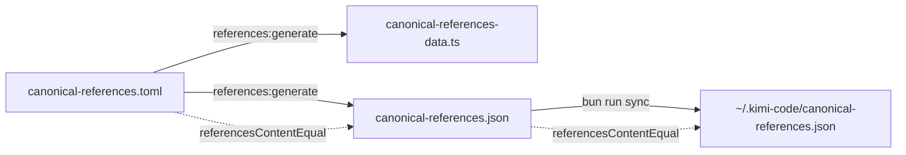
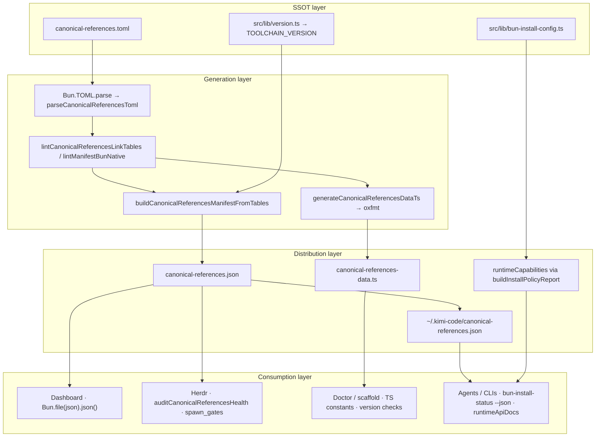

# Canonical references system

> How `canonical-references.json` stays trustworthy: schema, generation, freshness, drift, lint layers, and consumers.
> **Link-table SSOT:** `canonical-references.toml` → `src/lib/canonical-references-data.ts` + `canonical-references.json`.
> **Types & validators:** `src/lib/canonical-references.ts`, `canonical-references-manifest-lint.ts`, `canonical-references-toml.ts`.
> **Layer context:** [configuration-layers.md](./configuration-layers.md) § Discovery layer.

Agents and gates treat the manifest as the machine-readable index of ecosystem stacks, local docs, and upstream repos. This doc explains how that index is produced, validated, and kept aligned between the repo and `~/.kimi-code/`.

---

## Manifest schema

`canonical-references.json` is a single JSON object conforming to `CanonicalReferencesManifest`:

```json
{
  "schemaVersion": 1,
  "generatedAt": "2026-06-20T12:00:00.000Z",
  "toolchainVersion": "1.0.0",
  "ecosystem": [ ... ],
  "localDocs": [ ... ],
  "repos": [ ... ]
}
```

| Field              | Source constant                       | Purpose                                           |
| ------------------ | ------------------------------------- | ------------------------------------------------- |
| `schemaVersion`    | `CANONICAL_REFERENCES_SCHEMA_VERSION` | Breaking-change guard (`1` today)                 |
| `generatedAt`      | `new Date().toISOString()` at build   | Last content change timestamp (see § Freshness)   |
| `toolchainVersion` | `TOOLCHAIN_VERSION`                   | Toolchain release at generation time              |
| `ecosystem`        | `ECOSYSTEM_REFERENCES`                | External stacks: Bun, Effect, Kimi Code, Herdr, … |
| `localDocs`        | `LOCAL_DOC_REFERENCES`                | Repo/runtime doc paths, canvas metadata           |
| `repos`            | `REPO_REFERENCES`                     | GitHub upstream pointers, clone paths, `provides` |

Entry shapes are defined by `EcosystemReference`, `LocalDocReference`, and `RepoReference` in `canonical-references.ts`. Link-table rows live in `canonical-references.toml` and are emitted as `as const` arrays in `canonical-references-data.ts`.

The canonical structural schema is the Bun-native validator, not a separate JSON/TOML schema file. `lintCanonicalReferencesLinkTables()` + `lintManifestBunNative()` (Bun-native: `new URL`, `Bun.semver.order`, pattern sets) enforce every field rule. `lintCanonicalReferencesToml()` wraps both for raw TOML input. Runtime parsing via `isCanonicalReferencesManifest()` is only structural (version + three arrays exist).

---

## Generation pipeline

There is no separate compile step. Generation is a deterministic reflection of the TOML link tables.

```
canonical-references.toml          ← edit here (human SSOT)
        │
        ▼
  Bun.TOML.parse() → parseCanonicalReferencesToml()
        │
        ▼
  lintCanonicalReferencesToml()      ← Bun-native structural validation (the schema)
        │
        ├──▶ generateCanonicalReferencesDataTs() → oxfmt → canonical-references-data.ts
        │
        ├──▶ buildCanonicalReferencesManifestFromTables()
        │         │
        │         ▼
        │    finalizeCanonicalReferencesManifest(generated, existing)
        │         │
        │         ▼
        │    stableStringify() → canonical-references.json (repo root)
        │
        └──▶ --check: compare data.ts + JSON against disk (exit 1 on drift)
        │
        ▼
  bun run sync → collectRootLocalDocSyncPaths() → ~/.kimi-code/
```

### Root sync rule (manifest-driven)

`syncDesktop()` copies every `LOCAL_DOC_REFERENCES` row via `collectLocalDocSyncEntries()`:

```typescript
collectLocalDocSyncPaths();
// AGENTS.md, docs/references/testing-execution.md, examples/artifact-dependency-graphs.md, …
```

The self-referencing `canonical-references` row therefore controls distribution of the manifest itself. **All** `LOCAL_DOC_REFERENCES` rows sync via `collectLocalDocSyncEntries()` — nested paths (`docs/references/*.md`, `docs/*.md`, `examples/*.md`) map `repoPath` → `~/.kimi-code/<repoPath>`. Infra files not indexed as local docs (`error-taxonomy.yml`, `dx.config.toml`, …) stay in `SYNC_ROOT_INFRA`.

`lintLocalDocSyncPaths()` enforces `runtimePath === ~/.kimi-code/<repoPath>` for every row. Duplicate `repoPath` aliases (canvas companions) must share the same `runtimePath`.

### `buildCanonicalReferencesManifestFromTables()`

Spreads parsed link tables and attaches metadata:

```typescript
return {
  schemaVersion: CANONICAL_REFERENCES_SCHEMA_VERSION,
  generatedAt: new Date().toISOString(),
  toolchainVersion: TOOLCHAIN_VERSION,
  ecosystem: [...tables.ecosystem],
  localDocs: [...tables.localDocs],
  repos: [...tables.repos],
};
```

### `scripts/generate-canonical-references.ts`

| Flag      | Behavior                                                                                                 |
| --------- | -------------------------------------------------------------------------------------------------------- |
| (default) | Validate TOML → write `canonical-references-data.ts` + JSON → `lintRepoReferences()` → canvas sync       |
| `--check` | Fail if TOML invalid, `data.ts` stale, JSON stale, ecosystem↔repo incomplete, or canvas companions stale |
| `--json`  | Print manifest to stdout only (no write)                                                                 |

**Command:** `bun run references:generate`

`bun run lint` includes `generate-canonical-references.ts --check` as the `canonical-references` gate — committed `data.ts` and JSON must match TOML.

`bun run references:lint` validates TOML + repo reference rules without regenerating artifacts.

## Example-level canonical-references.toml

Example projects can declare their own `canonical-references.toml` with the same shape as the root SSOT but scoped to the dependencies they actually use. The Bun-native validator treats each file identically, so the same rules apply everywhere.

Example projects with a `canonical-references.toml`:

- `examples/dashboard/canonical-references.toml` — Bun/Effect/Kimi Code/Herdr/Oxc ecosystem + dashboard local docs
- `examples/portal/canonical-references.toml` — artifact portal ecosystem + portal local docs
- `examples/trading-workspace/canonical-references.toml` — trading workspace ecosystem + benchmark namespace docs

**Validation:** `bun run references:lint:examples` (or `bun run references:lint`, which includes it) walks `examples/*/canonical-references.toml` and runs `lintCanonicalReferencesToml()` on each. The root repo `references:lint` does not lint example files, but `quality:check:ci` runs `references:lint` which includes both root and example validation.

---

## Freshness and drift

Two independent alignment questions:

1. **Repo fresh** — Do `canonical-references-data.ts` and `canonical-references.json` match `canonical-references.toml`?
2. **Runtime aligned** — Does `~/.kimi-code/canonical-references.json` match the repo file?

### Content equality (what actually matters)

`referencesContentEqual(a, b)` compares only:

- `schemaVersion`
- `ecosystem` (stable-stringified)
- `localDocs` (stable-stringified)
- `repos` (stable-stringified)

It **ignores** `generatedAt` and `toolchainVersion`. A manifest can look "newer" by timestamp while still being content-identical.

`manifestNeedsRefresh(generated, existing)` returns `true` when there is no existing file or `referencesContentEqual` is false.

### `generatedAt` preservation

`finalizeCanonicalReferencesManifest()` keeps the previous `generatedAt` when link-table content is unchanged. This avoids timestamp-only git churn and meaningless sync deltas when someone re-runs generate without editing TOML.

### Typical drift scenarios

| Symptom                          | Cause                                               | Fix                                       |
| -------------------------------- | --------------------------------------------------- | ----------------------------------------- |
| `repo-fresh` error               | Edited TOML, forgot generate                        | `bun run references:generate`             |
| `data.ts stale` (check gate)     | TOML changed; `canonical-references-data.ts` behind | `bun run references:generate`             |
| `runtime-aligned` error          | Repo manifest updated, runtime stale                | `bun run sync`                            |
| `runtime-cache` error            | No file at `~/.kimi-code/`                          | `bun run sync` (after generate if needed) |
| Lint `canonical-references` gate | Committed artifacts behind TOML                     | `bun run references:generate`             |
| `package-pointer` warn           | `package.json` → `kimi.canonicalReferences` wrong   | Set to `canonical-references.json`        |



---

## Health audit (`auditCanonicalReferencesHealth`)

Used by `kimi-doctor`, ecosystem probes, and herdr handoff rules (`probe:canonical-references:*`).

| Check name        | Condition                                                  | Status if failing | Fix                           |
| ----------------- | ---------------------------------------------------------- | ----------------- | ----------------------------- |
| `repo-manifest`   | JSON missing or unparseable                                | `error`           | `bun run references:generate` |
| `repo-fresh`      | Content stale vs TOML-derived tables                       | `error`           | `bun run references:generate` |
| `runtime-cache`   | No runtime copy                                            | `error`           | `bun run sync`                |
| `runtime-aligned` | Runtime differs from repo                                  | `error`           | `bun run sync`                |
| `package-pointer` | `kimi.canonicalReferences` not `canonical-references.json` | `warn`            | Fix `package.json`            |

Report fields:

- `aligned` — `true` only when **every** check is `ok` (a `package-pointer` warn makes it `false`)
- `fixPlan` — deduplicated commands (`references:generate`, `sync`)
- `runtimeSynced` — repo and runtime manifests content-equal

Probe handoff IDs (suffix after `canonical-references:`):

- `repo-fresh`
- `runtime-aligned`
- `runtime-cache`

`repo-manifest` and `package-pointer` are audit-only — not exposed as probe conditions.

---

## Lint layers

Trust is enforced at multiple depths:

| Layer                       | Command / function                                | What it checks                                                                               |
| --------------------------- | ------------------------------------------------- | -------------------------------------------------------------------------------------------- |
| **TOML structural lint**    | `lintManifestBunNative()` (on every generate)     | IDs, URLs, semver, repo links, canvas metadata — Bun-native validators                       |
| **Repo reference lint**     | `lintRepoReferences()` (runs on every generate)   | GitHub URL shape, duplicate ids/urls, `provides` links, ecosystem↔repo pairing, clone paths  |
| **CI lint (no regen)**      | `bun run references:lint`                         | TOML parse + `lintManifestBunNative` + `lintRepoReferences`                                  |
| **Committed parity**        | `bun run lint` → `references:generate --check`    | `data.ts` + JSON on disk match TOML                                                          |
| **URL shape**               | `lintRepoUrls()`, `references:inspect --validate` | `https://github.com/:org/:repo` pattern only — not live HTTP                                 |
| **Markdown links**          | `bun run lint:links` / `lint:links:online`        | Internal doc links; optional HEAD on external URLs in markdown                               |
| **Ecosystem URLs (opt-in)** | `bun run references:lint-online`                  | Live HEAD/GET on ecosystem `homepage` and `docs` (skips non-http paths like `dx` local docs) |
| **Inspect / snapshot**      | `bun run references:inspect --plain`              | Human tables; unit snapshot guards render drift                                              |

Online ecosystem checks are **not** part of `bun run check` — use in scheduled CI or manual audits.

---

## Consumers

| Consumer                            | Reads                                   | Purpose                                                                                                            |
| ----------------------------------- | --------------------------------------- | ------------------------------------------------------------------------------------------------------------------ |
| `~/.kimi-code/` agents              | Runtime copy after `sync`               | Stack links, doc index outside repo checkout                                                                       |
| `kimi-doctor` / ecosystem health    | `auditCanonicalReferencesHealth`        | Freshness + runtime alignment in doctor reports                                                                    |
| Herdr orchestrator                  | `probe:canonical-references:*`          | Handoff gates before workflows that need current refs                                                              |
| `formatCanonicalReferencesMarkdown` | `ECOSYSTEM_REFERENCES` etc. (from data) | CONTEXT.md / README ecosystem tables                                                                               |
| `references:inspect`                | Generated arrays                        | Terminal tables (`--plain`, `--json`)                                                                              |
| `references:inspect --watch`        | TOML + `data.ts` + JSON file watchers   | Live dashboard; `bun run references:inspect:watch` for HMR                                                         |
| Canvas companion sync               | `LOCAL_DOC_REFERENCES` + `cursorCanvas` | Regenerates canvas companion files on generate                                                                     |
| Doc-link lint                       | Ecosystem URLs in markdown              | Cross-check against manifest rows                                                                                  |
| Dashboard thumbnails                | `src/lib/bun-image.ts`                  | WebView PNG → `Bun.Image.metadata()` → `/api/thumbnail` (see [dashboard-thumbnails.md](./dashboard-thumbnails.md)) |

---

## Commands

| Task                       | Command                                                   |
| -------------------------- | --------------------------------------------------------- |
| Regenerate artifacts       | `bun run references:generate`                             |
| Verify committed artifacts | `bun run references:generate --check`                     |
| Lint TOML without regen    | `bun run references:lint`                                 |
| Inspect tables             | `bun run references:inspect`                              |
| Live inspect dashboard     | `bun run references:inspect --watch`                      |
| HMR-aware watch            | `bun run references:inspect:watch`                        |
| Plain terminal output      | `bun run references:inspect --plain --section all`        |
| JSON export                | `bun run references:inspect --json`                       |
| Live ecosystem URL check   | `bun run references:lint-online`                          |
| Push to runtime            | `bun run sync && bun run sync:verify`                     |
| Full health picture        | `auditCanonicalReferencesHealth` via doctor or unit tests |

### Edit workflow

1. Edit link tables in `canonical-references.toml`.
2. `bun run references:generate` (validates TOML, writes `canonical-references-data.ts` + JSON, runs repo reference lint).
3. `bun run sync && bun run sync:verify` when runtime agents need the update.
4. `bun run check:fast` before commit.

Adding a `docs/references/*.md` doc: add a `[[localDocs]]` row in TOML → generate → sync.

---

## System architecture

The canonical-references loop is one half of agent-facing discovery. **Ecosystem stacks, local docs, and repos** live in `canonical-references.toml`. **Bun runtime APIs, profiling, and benchmarking** live in `src/lib/bun-install-config.ts` (`runtimeCapabilities`, including `runtimeApiDocs`).



### Validation gates (CI)

| Gate              | Command / probe                          | Checks                                               |
| ----------------- | ---------------------------------------- | ---------------------------------------------------- |
| TOML + repo lint  | `bun run references:lint`                | Parse, link tables, repo pairing                     |
| Artifact drift    | `bun run references:generate --check`    | `data.ts` + JSON match TOML                          |
| Full lint bundle  | `bun run lint`                           | Includes `--check` above                             |
| Health / handoff  | `probe:canonical-references:*`           | `repo-fresh`, `runtime-aligned`, `runtime-cache`     |
| Unit tests        | `test/canonical-references.unit.test.ts` | 59 pass (includes `--plain` snapshot)                |
| Watch CLI         | `bun run references:inspect:watch`       | `references-inspect-watch.ts` + 7 unit tests         |
| Install policy    | `test/bun-install-config.unit.test.ts`   | 54+ pass (`runtimeApiDocs`, profiling, benchmarking) |
| Runtime inventory | `auditRuntimeCapabilitiesHealth`         | `runtimeApiDocs` (5 URLs) + 17 capability keys       |
| Config layers     | `bun run config:status`                  | `bun-install-runtime` gate (inline audit)            |
| Doctor probe      | `kimi-doctor --probe`                    | `bunRuntimeCapabilities` embed                       |
| Handoff           | `probe:bun-install:*`                    | `evaluateBunInstallProbeHandoffCondition`            |

### Bun primitives in the pipeline

| Primitive                             | Role                              |
| ------------------------------------- | --------------------------------- |
| `Bun.TOML.parse`                      | SSOT → typed tables               |
| `new URL()` / `URLPattern`            | URL and GitHub shape validation   |
| `Bun.semver.order`                    | `minVersion`, canvas semver       |
| `Bun.file(...).text()` / `.json()`    | TOML read; runtime manifest load  |
| `Bun.write(...)`                      | Generated artifact output         |
| `Bun.inspect.table`                   | `references:inspect` tables       |
| `Bun.stripANSI` / `Bun.markdown.ansi` | `--plain` and `--watch` rendering |

No external dependencies in the generate/lint path — validators and generators use Bun built-ins only.

### `runtimeApiDocs` (parallel discovery)

`runtimeApiDocs` in `buildRuntimeCapabilities()` points agents at narrative runtime indexes plus typed reference and docs RSS:

| Field             | URL                                     |
| ----------------- | --------------------------------------- |
| `globalsUrl`      | `https://bun.com/docs/runtime/globals`  |
| `bunApisUrl`      | `https://bun.com/docs/runtime/bun-apis` |
| `webApisUrl`      | `https://bun.com/docs/runtime/web-apis` |
| `apiReferenceUrl` | `https://bun.com/reference/bun`         |
| `docsRssUrl`      | `https://bun.com/rss.xml`               |

Inspect programmatically: `bun run scripts/bun-install-status.ts --json` → `runtimeCapabilities.runtimeApiDocs`.

---

## Related

- [configuration-layers.md](./configuration-layers.md) — four-layer model; discovery vs define vs parity
- [namespace.md](./namespace.md) — manifest row semantics vs `dx.config.toml` keys
- [kimi-doctor.md](./kimi-doctor.md) — doctor integration and probe wiring
- [dashboard-thumbnails.md](./dashboard-thumbnails.md) — `Bun.Image` thumbnail pipeline (`src/lib/bun-image.ts`)
- `docs/handoff-rules.md` — herdr `probe:canonical-references:*` conditions
