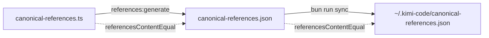

# Canonical references system

> How `canonical-references.json` stays trustworthy: schema, generation, freshness, drift, lint layers, and consumers.
> **Code SSOT:** `src/lib/canonical-references.ts` (`ECOSYSTEM_REFERENCES`, `LOCAL_DOC_REFERENCES`, `REPO_REFERENCES`).
> **Layer context:** [configuration-layers.md](./configuration-layers.md) § Discovery layer.

Agents and gates treat the manifest as the machine-readable index of ecosystem stacks, local docs, and upstream repos. This doc explains how that index is produced, validated, and kept aligned between the repo and `~/.kimi-code/`.

---

## Manifest schema

`canonical-references.json` is a single JSON object conforming to `CanonicalReferencesManifest`:

```json
{
  "schemaVersion": 1,
  "generatedAt": "2026-06-20T12:00:00.000Z",
  "toolchainVersion": "1.0.0",
  "ecosystem": [ ... ],
  "localDocs": [ ... ],
  "repos": [ ... ]
}
```

| Field              | Source constant                       | Purpose                                           |
| ------------------ | ------------------------------------- | ------------------------------------------------- |
| `schemaVersion`    | `CANONICAL_REFERENCES_SCHEMA_VERSION` | Breaking-change guard (`1` today)                 |
| `generatedAt`      | `new Date().toISOString()` at build   | Last content change timestamp (see § Freshness)   |
| `toolchainVersion` | `TOOLCHAIN_VERSION`                   | Toolchain release at generation time              |
| `ecosystem`        | `ECOSYSTEM_REFERENCES`                | External stacks: Bun, Effect, Kimi Code, Herdr, … |
| `localDocs`        | `LOCAL_DOC_REFERENCES`                | Repo/runtime doc paths, canvas metadata           |
| `repos`            | `REPO_REFERENCES`                     | GitHub upstream pointers, clone paths, `provides` |

Entry shapes are defined by `EcosystemReference`, `LocalDocReference`, and `RepoReference` at the top of `canonical-references.ts`. Runtime parsing via `isCanonicalReferencesManifest()` is **structural** (version + three arrays exist) — not per-field schema validation.

---

## Generation pipeline

There is no separate compile step. Generation is a deterministic reflection of the TypeScript source arrays.

```
src/lib/canonical-references.ts
  ECOSYSTEM_REFERENCES / LOCAL_DOC_REFERENCES / REPO_REFERENCES
        │
        ▼
  buildCanonicalReferencesManifest()
        │
        ▼
  finalizeCanonicalReferencesManifest(generated, existing)   ← preserves generatedAt when content unchanged
        │
        ▼
  stableStringify() → canonical-references.json (repo root)
        │
        ▼
  bun run sync → collectRootLocalDocSyncPaths() → ~/.kimi-code/
```

### Root sync rule (manifest-driven)

`syncDesktop()` copies every `LOCAL_DOC_REFERENCES` row via `collectLocalDocSyncEntries()`:

```typescript
collectLocalDocSyncPaths();
// AGENTS.md, docs/references/testing-execution.md, examples/artifact-dependency-graphs.md, …
```

The self-referencing `canonical-references` row therefore controls distribution of the manifest itself. **All** `LOCAL_DOC_REFERENCES` rows sync via `collectLocalDocSyncEntries()` — nested paths (`docs/references/*.md`, `docs/*.md`, `examples/*.md`) map `repoPath` → `~/.kimi-code/<repoPath>`. Infra files not indexed as local docs (`error-taxonomy.yml`, `dx.config.toml`, …) stay in `SYNC_ROOT_INFRA`.

`lintLocalDocSyncPaths()` enforces `runtimePath === ~/.kimi-code/<repoPath>` for every row. Duplicate `repoPath` aliases (canvas companions) must share the same `runtimePath`.

### `buildCanonicalReferencesManifest()`

Spreads the three source arrays and attaches metadata:

```typescript
return {
  schemaVersion: CANONICAL_REFERENCES_SCHEMA_VERSION,
  generatedAt: new Date().toISOString(),
  toolchainVersion: TOOLCHAIN_VERSION,
  ecosystem: [...ECOSYSTEM_REFERENCES],
  localDocs: [...LOCAL_DOC_REFERENCES],
  repos: [...REPO_REFERENCES],
};
```

### `scripts/generate-canonical-references.ts`

| Flag      | Behavior                                                                      |
| --------- | ----------------------------------------------------------------------------- |
| (default) | `lintRepoReferences()` → write manifest → `syncCanvasCompanions()`            |
| `--check` | Fail if manifest stale, ecosystem↔repo incomplete, or canvas companions stale |
| `--json`  | Print manifest to stdout only (no write)                                      |

**Command:** `bun run references:generate`

`bun run lint` includes `generate-canonical-references.ts --check` as the `canonical-references` gate — committed JSON must match source tables.

---

## Freshness and drift

Two independent alignment questions:

1. **Repo fresh** — Does `canonical-references.json` match `src/lib/canonical-references.ts`?
2. **Runtime aligned** — Does `~/.kimi-code/canonical-references.json` match the repo file?

### Content equality (what actually matters)

`referencesContentEqual(a, b)` compares only:

- `schemaVersion`
- `ecosystem` (stable-stringified)
- `localDocs` (stable-stringified)
- `repos` (stable-stringified)

It **ignores** `generatedAt` and `toolchainVersion`. A manifest can look "newer" by timestamp while still being content-identical.

`manifestNeedsRefresh(generated, existing)` returns `true` when there is no existing file or `referencesContentEqual` is false.

### `generatedAt` preservation

`finalizeCanonicalReferencesManifest()` keeps the previous `generatedAt` when link-table content is unchanged. This avoids timestamp-only git churn and meaningless sync deltas when someone re-runs generate without editing source arrays.

### Typical drift scenarios

| Symptom                          | Cause                                             | Fix                                       |
| -------------------------------- | ------------------------------------------------- | ----------------------------------------- |
| `repo-fresh` error               | Edited TS arrays, forgot generate                 | `bun run references:generate`             |
| `runtime-aligned` error          | Repo manifest updated, runtime stale              | `bun run sync`                            |
| `runtime-cache` error            | No file at `~/.kimi-code/`                        | `bun run sync` (after generate if needed) |
| Lint `canonical-references` gate | Committed JSON behind source                      | `bun run references:generate`             |
| `package-pointer` warn           | `package.json` → `kimi.canonicalReferences` wrong | Set to `canonical-references.json`        |



---

## Health audit (`auditCanonicalReferencesHealth`)

Used by `kimi-doctor`, ecosystem probes, and herdr handoff rules (`probe:canonical-references:*`).

| Check name        | Condition                                                  | Status if failing | Fix                           |
| ----------------- | ---------------------------------------------------------- | ----------------- | ----------------------------- |
| `repo-manifest`   | JSON missing or unparseable                                | `error`           | `bun run references:generate` |
| `repo-fresh`      | Content stale vs source arrays                             | `error`           | `bun run references:generate` |
| `runtime-cache`   | No runtime copy                                            | `error`           | `bun run sync`                |
| `runtime-aligned` | Runtime differs from repo                                  | `error`           | `bun run sync`                |
| `package-pointer` | `kimi.canonicalReferences` not `canonical-references.json` | `warn`            | Fix `package.json`            |

Report fields:

- `aligned` — `true` only when **every** check is `ok` (a `package-pointer` warn makes it `false`)
- `fixPlan` — deduplicated commands (`references:generate`, `sync`)
- `runtimeSynced` — repo and runtime manifests content-equal

Probe handoff IDs (suffix after `canonical-references:`):

- `repo-fresh`
- `runtime-aligned`
- `runtime-cache`

`repo-manifest` and `package-pointer` are audit-only — not exposed as probe conditions.

---

## Lint layers

Trust is enforced at multiple depths:

| Layer                       | Command / function                                | What it checks                                                                               |
| --------------------------- | ------------------------------------------------- | -------------------------------------------------------------------------------------------- |
| **Repo reference lint**     | `lintRepoReferences()` (runs on every generate)   | GitHub URL shape, duplicate ids/urls, `provides` links, ecosystem↔repo pairing, clone paths  |
| **Committed parity**        | `bun run lint` → `references:generate --check`    | JSON on disk matches source arrays                                                           |
| **URL shape**               | `lintRepoUrls()`, `references:inspect --validate` | `https://github.com/:org/:repo` pattern only — not live HTTP                                 |
| **Markdown links**          | `bun run lint:links` / `lint:links:online`        | Internal doc links; optional HEAD on external URLs in markdown                               |
| **Ecosystem URLs (opt-in)** | `bun run references:lint-online`                  | Live HEAD/GET on ecosystem `homepage` and `docs` (skips non-http paths like `dx` local docs) |
| **Inspect / snapshot**      | `bun run references:inspect --plain`              | Human tables; unit snapshot guards render drift                                              |

Online ecosystem checks are **not** part of `bun run check` — use in scheduled CI or manual audits.

---

## Consumers

| Consumer                            | Reads                                   | Purpose                                               |
| ----------------------------------- | --------------------------------------- | ----------------------------------------------------- |
| `~/.kimi-code/` agents              | Runtime copy after `sync`               | Stack links, doc index outside repo checkout          |
| `kimi-doctor` / ecosystem health    | `auditCanonicalReferencesHealth`        | Freshness + runtime alignment in doctor reports       |
| Herdr orchestrator                  | `probe:canonical-references:*`          | Handoff gates before workflows that need current refs |
| `formatCanonicalReferencesMarkdown` | Source arrays                           | CONTEXT.md / README ecosystem tables                  |
| `references:inspect`                | Source arrays                           | Terminal tables (`--plain`, `--json`)                 |
| Canvas companion sync               | `LOCAL_DOC_REFERENCES` + `cursorCanvas` | Regenerates canvas companion files on generate        |
| Doc-link lint                       | Ecosystem URLs in markdown              | Cross-check against manifest rows                     |

---

## Commands

| Task                        | Command                                                   |
| --------------------------- | --------------------------------------------------------- |
| Regenerate manifest         | `bun run references:generate`                             |
| Verify committed JSON fresh | `bun run references:generate --check`                     |
| Inspect tables              | `bun run references:inspect`                              |
| Plain terminal output       | `bun run references:inspect --plain --section all`        |
| JSON export                 | `bun run references:inspect --json`                       |
| Live ecosystem URL check    | `bun run references:lint-online`                          |
| Push to runtime             | `bun run sync && bun run sync:verify`                     |
| Full health picture         | `auditCanonicalReferencesHealth` via doctor or unit tests |

### Edit workflow

1. Edit arrays in `src/lib/canonical-references.ts`.
2. `bun run references:generate` (runs repo reference lint + writes JSON).
3. `bun run sync && bun run sync:verify` when runtime agents need the update.
4. `bun run check:fast` before commit.

Adding a `docs/references/*.md` doc: add a `LOCAL_DOC_REFERENCES` row → generate → sync.

---

## Related

- [configuration-layers.md](./configuration-layers.md) — four-layer model; discovery vs define vs parity
- [namespace.md](./namespace.md) — manifest row semantics vs `dx.config.toml` keys
- [kimi-doctor.md](./kimi-doctor.md) — doctor integration and probe wiring
- `docs/handoff-rules.md` — herdr `probe:canonical-references:*` conditions
