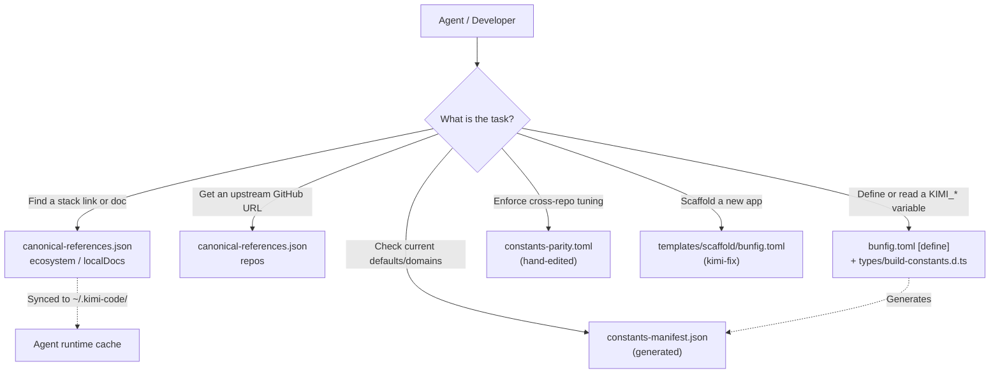

# Configuration & Reference Layers: Discovery, Build, Parity, and Scaffold

This repository uses **four distinct configuration layers**. They are not interchangeable. They serve different architectural purposes, have different SSOTs (Source of Truth), and live in different places.

**Gold rule for agents:** Do not treat these files as aliases. Always consult the correct layer for the task at hand.

---

## The Four-Layer Model

| Layer                   | File                                  | Edit SSOT (Source of Truth)                                                         | Generated?                              | Synced to `~/.kimi-code/`?                                                                                                                                                                               |
| :---------------------- | :------------------------------------ | :---------------------------------------------------------------------------------- | :-------------------------------------- | :------------------------------------------------------------------------------------------------------------------------------------------------------------------------------------------------------- |
| **Discovery**           | `canonical-references.json`           | `src/lib/canonical-references.ts`                                                   | **Yes** (`bun run references:generate`) | **Yes** (agents read from the synced copy)                                                                                                                                                               |
| **Define Registry**     | `constants-manifest.json`             | `bunfig.toml` (`[define]`) + `types/build-constants.d.ts`                           | **Yes** (`bun run manifest:generate`)   | **No** (repo-only)                                                                                                                                                                                       |
| **Cross-Repo Contract** | `constants-parity.toml`               | Hand-edited TOML (maintained manually)                                              | **No**                                  | **No** (repo-only)                                                                                                                                                                                       |
| **App Scaffold**        | `templates/scaffold/bunfig.toml`      | Template file (copied by `kimi-fix`)                                                | **No**                                  | N/A (installed per new project). For details on `bun create` flags and Bun install configuration (including the experimental global store), see [Bun runtime scaffold flags](./bun-runtime-scaffold.md). |
| **Runtime Artifacts**   | `thresholds.json`, `perf-report.html` | Generated by **`perf-doctor --train` / `--report`** (default `KIMI_MODULES=doctor`) | **No** (runtime output)                 | **No** (per-project, `.gitignore`-d) — see [kimi-doctor.md](./kimi-doctor.md) § Effects pipeline.                                                                                                        |

---

## Anti-Confusion Rules (Read This First)

1. **`repos` ≠ parity repo list ≠ local working dirs.**  
   `canonical-references.json` → `repos` contains exactly **three** major upstream GitHub pointers (`kimi-toolchain`, `kimi-code-upstream`, `effect-upstream`). It does _not_ list `accounting-telegram` or any local working tree.

2. **Parity inclusion does not imply canonical discovery inclusion.**  
   `accounting-telegram` lives in `constants-parity.toml` (because it must share tuning parameters) but is **intentionally omitted** from `canonical-references.json` → `repos`.

3. **Change values in `bunfig.toml`, not in `constants-manifest.json`.**  
   `constants-manifest.json` is **generated** from `bunfig.toml` and `types/build-constants.d.ts` via `src/lib/build-constants-registry.ts`. Any manual edits there will be overwritten. The true SSOT is `bunfig.toml` `[define]` + `types/build-constants.d.ts`.

4. **Scaffold `bunfig.toml` has no `[define]`.**  
   `templates/scaffold/bunfig.toml` only manages install and test policy for greenfield apps created via `kimi-fix`. Toolchain `KIMI_*` defines live **only** in the root `bunfig.toml`.

---

## Agent Decision Table

| If you are trying to…                                         | Look at…                                                                            |
| :------------------------------------------------------------ | :---------------------------------------------------------------------------------- |
| Find external stack links or indexed local docs               | `canonical-references.json` → `ecosystem` / `localDocs`                             |
| Understand manifest freshness, drift, lint, and consumers     | [canonical-references-system.md](./canonical-references-system.md)                  |
| Find the GitHub URL for a major upstream project              | `canonical-references.json` → `repos` (3 entries)                                   |
| Read or change a `KIMI_*` value                               | Root `bunfig.toml` (`[define]`) + `types/build-constants.d.ts`                      |
| Discover defaults, domains, or the generated define inventory | `constants-manifest.json`                                                           |
| Verify two repos must share the same tunable parameters       | `constants-parity.toml`                                                             |
| Bootstrap a new app's install/test policy                     | `templates/scaffold/bunfig.toml` (via `kimi-fix`)                                   |
| Scaffold perf harness + perf-doctor CLI                       | `kimi-fix` with default `KIMI_MODULES=doctor` (`src/lib/scaffold-modules.ts`)       |
| Auto-repair bare Promise / domain import violations           | `kimi-heal --fix` or `kimi-heal effect audit --fix`                                 |
| Configure serve-probe port / Herdr doctor tabs                | `dx.config.toml` `[doctor]` + `[doctor.probe]` — [serve-probe.md](./serve-probe.md) |
| Choose test script (fast vs changed vs parallel vs shard)     | [testing-execution.md](./testing-execution.md) + `BUN_TEST_EXECUTION_STRATEGY`      |

---

## Visual Overview (Discovery vs Build vs Parity vs Scaffold)

---

## How the Repository Enforces This (Lint / Doctor Wiring)

| Gate                                | Command / lint label                                           |
| :---------------------------------- | :------------------------------------------------------------- |
| **One-shot audit (all core gates)** | `bun run config:status`                                        |
| Canonical refs are fresh            | `bun run references:generate --check` → `canonical-references` |
| Manifest is fresh                   | `bun run manifest:generate --check` → `constants-manifest`     |
| Parity is aligned                   | `bun run lint:constant-parity` → `constant-parity`             |
| Runtime cache is valid              | `bun run sync`; handoff probes `probe:canonical-references:*`  |

Manifest id: `configuration-layers` · repo: `docs/references/configuration-layers.md` · runtime: `~/.kimi-code/docs/references/configuration-layers.md` · canvas: `docs/canvases/configuration-layers.canvas.tsx` (IDE pointer via `cursorCanvas`; not synced)

## Related docs

| Topic                                                    | Path                                                                  |
| -------------------------------------------------------- | --------------------------------------------------------------------- |
| Build-time constants naming (`defineDomain`, taxonomyId) | [CODE_REFERENCES.md](../../CODE_REFERENCES.md) § Build-time constants |
| Ecosystem manifest and handoff probes                    | [namespace.md](./namespace.md)                                        |
| Ecosystem link SSOT                                      | `src/lib/canonical-references.ts` → `canonical-references.json`       |
| Define registry generator                                | `src/lib/build-constants-registry.ts` → `constants-manifest.json`     |
| Cross-repo parity config                                 | `constants-parity.toml`                                               |
| Bun runtime scaffold flags and install config            | [bun-runtime-scaffold.md](./bun-runtime-scaffold.md)                  |
| Effects pipeline and thresholds                          | [kimi-doctor.md](./kimi-doctor.md) § Effects pipeline                 |
