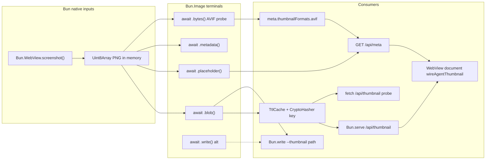

# Dashboard thumbnails and WebView profile

How the Herdr orchestrator dashboard turns a live `Bun.WebView` screenshot into a compressed thumbnail served by the dashboard HTTP server, and how that relates to the WebView's persistent `dataStore` profile.

**Namespace:** `/api/thumbnail` is **orchestrator HTTP** (`Bun.serve`) — not a `[[endpoints]]` inventory row and not a Herdr `prefix+*` action. For collisions with `herdr-orchestrator` (CLI vs plugin) or endpoint tables, `@see namespace-boundaries` → [namespace.md § Name collision resolver](./namespace.md#name-collision-resolver).

**Canvas companion:** `docs/canvases/herdr-dashboard-thumbnails.canvas.tsx` (manifest id `dashboard-thumbnails` · `cursorCanvas` pointer; not synced).

**Related perf loop:** The reference dashboard (`examples/dashboard`) also hosts the **perf-doctor** harness (`/api/perf-registry`, HTTP protocol benchmarks). Scaffolded via default `KIMI_MODULES=doctor` — see [kimi-doctor.md](./kimi-doctor.md) § Effects pipeline.

## High-level flow

```
Bun.WebView (dashboard UI)
  │  screenshot({ format: "png" })
  ▼
Uint8Array PNG ──→ herdr-dashboard-automation.ts
  │  feedDashboardScreenshotPng() polls every 2s
  ▼
HerdrDashboardServerHandle.setScreenshotPng(png)
  │
  ├──→ /api/meta      exposes thumbnail capability + ThumbHash placeholder
  │
  └──→ /api/thumbnail reads PNG → Bun.Image.resize/encode → WebP/AVIF response
       │
       └──→ (same WebView document) herdr-dashboard.js fetch /api/meta + /api/thumbnail → #agent-thumb
```

## Server vs WebView document consumer

One `Bun.WebView` instance hosts **both** the Bun-native screenshot feed and the dashboard HTML/JS. They are different API surfaces in the same window — not a separate browser app.

| Side                                                  | Encode                                                                                                 | Consume                                                                                          |
| ----------------------------------------------------- | ------------------------------------------------------------------------------------------------------ | ------------------------------------------------------------------------------------------------ |
| **Server** (Bun host + `Bun.Image` terminals)         | `await .blob()` / `.bytes()` / `.placeholder()` on PNG; optional `.write(dest)` or `Bun.write` for CLI | `setScreenshotPng` feed → `dashboardThumbnailBytes` on `GET /api/thumbnail`                      |
| **WebView document** (`templates/herdr-dashboard.js`) | None — client does not encode                                                                          | `fetch /api/meta` → LQIP; `new Image()` → `GET /api/thumbnail`; `wireAgentThumbnail` DOM updates |

The WebView document path is a **pure consumer** — standard web APIs (`fetch`, `Image`, DOM). No `Bun.Image` on the client.

## Bun.Image pipeline

Source module: `src/lib/bun-image.ts`

- Input is always a PNG `Uint8Array` from `Bun.WebView.screenshot()`.
- Default thumbnail size is **320×180** (`fit: "inside"`, `withoutEnlargement: true`).
- Output formats: **WebP** (default), **AVIF**, **JPEG**, **PNG**.
- AVIF is negotiated from the HTTP `Accept` header on macOS/Windows; falls back to WebP with `ERR_IMAGE_FORMAT_UNSUPPORTED` on Linux or older Apple Silicon.
- ThumbHash LQIP is generated from the same PNG for the `/api/meta` `placeholder` field.
- Encoded thumbnails are cached in memory by a SHA-256 key over source bytes + dimensions + quality + format.

### Terminals

Bun.Image pipelines are **lazy** until a terminal is awaited (`.bytes()`, `.blob()`, `.write()`, etc.). Work runs off the JavaScript thread when the terminal resolves.

#### `.write()` terminal

`Bun.Image` exposes a `.write(dest)` terminal alongside `.bytes()` and `.blob()`. It accepts the same destinations as `Bun.write`:

- `string` path
- `Bun.file()`
- `Bun.s3()`
- file descriptor (`fd`)

When **no format method** (`.webp()`, `.avif()`, `.png()`, etc.) is chained and the destination is a path string, the file extension determines the output format (`.jpg` / `.png` / `.webp` / `.heic` / `.avif`).

Example:

```ts
await new Bun.Image(png).resize(320, 180, { fit: "inside" }).webp().write("thumb.webp");
```

**Current usage note:** We do **not** use the `.write()` terminal today. The CLI `--thumbnail` path uses `dashboardWebpThumbnail(png)` → `Uint8Array` → `Bun.write(thumbnailPath, thumb)`. This keeps the encoded bytes available for `TtlCache` and tests.

Our encode path:

1. `dashboardThumbnailPipeline()` — resize + format chain (`maxPixels` guard on constructor).
2. `dashboardThumbnailBlob()` — `await … .blob()` (primary terminal).
3. `dashboardThumbnailBytes()` — blob → `Uint8Array` for `TtlCache` and `Response`.
4. `GET /api/thumbnail` — returns **pre-encoded** bytes on cache hit/miss; does **not** pass a live pipeline to `new Response()`.

AVIF capability probe uses `await … .bytes()` once → `meta.thumbnailFormats.avif` (not the `/api/meta` body itself).

See [Bun.Image Terminals](https://bun.com/docs/runtime/image#terminals) and [Bun.serve integration](https://bun.com/docs/runtime/image) (same page).

### Call sites and Bun API pairing



| File                                         | Function / route                     | Terminal                    | Role                                       |
| -------------------------------------------- | ------------------------------------ | --------------------------- | ------------------------------------------ |
| `src/lib/bun-image.ts`                       | `dashboardThumbnailBlob`             | `await … .blob()`           | Primary encode; AVIF miss → WebP `.blob()` |
| `src/lib/bun-image.ts`                       | `dashboardThumbnailBytes`            | via blob                    | `/api/thumbnail` cache miss                |
| `src/lib/bun-image.ts`                       | `probeBunImageAvifEncode`            | `await … .bytes()`          | `meta.thumbnailFormats.avif` probe         |
| `src/lib/bun-image.ts`                       | `imagePlaceholderDataUrl`            | `await … .placeholder()`    | `meta.placeholder` LQIP                    |
| `src/lib/bun-image.ts`                       | `imageMetadata`                      | `await … .metadata()`       | Header-only dimension read                 |
| `src/lib/herdr-dashboard-server.ts`          | `GET /api/thumbnail`                 | `dashboardThumbnailBytes()` | Cached `Uint8Array` response               |
| `src/lib/herdr-dashboard-server.ts`          | `GET /api/meta`                      | `imagePlaceholderDataUrl`   | ThumbHash on cached PNG                    |
| `src/lib/herdr-dashboard-automation.ts`      | `feedDashboardScreenshotPng`         | _(none)_                    | `setScreenshotPng` only — encode on GET    |
| `src/lib/herdr-dashboard-automation.ts`      | `{ type: "screenshot", feed: true }` | _(none)_                    | Same deferred encode                       |
| `src/lib/herdr-dashboard-automation.ts`      | `runHerdrDashboardAutomation`        | `dashboardWebpThumbnail`    | CLI `--thumbnail` → `Bun.write`            |
| `src/lib/herdr-webview-dashboard.ts`         | webview shell                        | calls feed poll             | Live PNG feed every 2s                     |
| `src/lib/herdr-dashboard-automation-gate.ts` | `runDashboardAutomationGate`         | indirect                    | smoke feed + `fetch /api/thumbnail`        |
| `src/bin/herdr-orchestrator.ts`              | `dashboard --probe`                  | via automation              | `--thumbnail <path>` disk WebP             |
| `templates/herdr-dashboard.js`               | thumbnail panel                      | browser `fetch`             | Consumes encoded bytes + LQIP              |

**Co-located Bun native APIs** (document alongside [Terminals](https://bun.com/docs/runtime/image#terminals)):

| Bun API                                     | Doc link                                                                                                                                                                | Used with Bun.Image at                                                                                 |
| ------------------------------------------- | ----------------------------------------------------------------------------------------------------------------------------------------------------------------------- | ------------------------------------------------------------------------------------------------------ |
| `Bun.WebView.screenshot({ format: "png" })` | [webview#screenshots](https://bun.com/docs/runtime/webview#screenshots)                                                                                                 | `webViewScreenshotBytes()` — **only** PNG input to pipeline                                            |
| `Bun.serve` + `fetch` handler               | [Bun.serve integration](https://bun.com/docs/runtime/image) · [api/http](https://bun.com/docs/api/http)                                                                 | `startHerdrDashboardServer` — returns pre-encoded bytes, not live pipeline                             |
| `await img….write(dest)`                    | Image terminal · same destinations as `Bun.write` (path / `Bun.file()` / `Bun.s3()` / fd) · extension rule applies when no format chained · see [Terminals](#terminals) | Not used today                                                                                         |
| `Bun.write(path, bytes)`                    | [Bun.write](https://bun.com/docs/runtime/bun-apis#bun-write)                                                                                                            | Standalone write of already-encoded bytes · used by CLI `--thumbnail` after `dashboardWebpThumbnail()` |
| `Bun.CryptoHasher("sha256")`                | [Bun.CryptoHasher](https://bun.com/docs/runtime/hashing)                                                                                                                | `thumbnailCacheKey()` — cache key over source PNG + encode params                                      |
| `fetch` + `AbortSignal.timeout`             | [fetch](https://bun.com/docs/api/fetch)                                                                                                                                 | `probeDashboardThumbnail()` in automation gate                                                         |
| `Bun.sleep`                                 | [Bun.sleep](https://bun.com/docs/runtime/bun-apis#bun-sleep)                                                                                                            | WebView settle before screenshot in automation                                                         |
| `new Response(Uint8Array \| Blob)`          | —                                                                                                                                                                       | `/api/thumbnail` hit (cached) and miss (post-terminal bytes)                                           |

**Project-local (not Bun):** `TtlCache` in `src/lib/cache.ts` stores **terminal output** (`Uint8Array`), TTL `2 × sse_poll_ms`.

### Patterns we intentionally avoid

| Alternative                                     | Why not                                                                                                                                    |
| ----------------------------------------------- | ------------------------------------------------------------------------------------------------------------------------------------------ |
| `new Response(imgPipeline)` on `/api/thumbnail` | Bun docs: encode may run synchronously during body init                                                                                    |
| Could use `.write()` terminal                   | `await dashboardThumbnailPipeline(png, opts).write(thumbnailPath)` — single await, Image terminal handles encoding + write                 |
| We actually use                                 | `dashboardWebpThumbnail(png)` → `Uint8Array` → `Bun.write(thumbnailPath, thumb)` — reuses bytes for cache + tests; same bytes land on disk |
| `.toBase64()` / `.dataurl()` for LQIP           | `.placeholder()` yields smaller ThumbHash (~400–700 B)                                                                                     |

## WebView profile (`dataStore`)

Source modules: `src/lib/herdr-dashboard-webview-store.ts`, `src/lib/herdr-webview-dashboard.ts`

`Bun.WebView` accepts a `dataStore` option:

- `"ephemeral"` (default) — cookies, localStorage, and session state are discarded when the WebView closes.
- `{ directory }` — persistent profile directory on disk.

The dashboard CLI resolves persistence from `dx.config.toml`:

```toml
[herdr.orchestrator.dashboard]
stale_ms = 15000
sse_poll_ms = 5000
poll_hint_ms = 5000
persist_profile = true           # uses default ~/.kimi-code/var/herdr-orchestrator-dashboard-webview
# profile_dir = "/custom/path"   # optional override
```

**Important:** the `dataStore` directory holds browser state only (WebKit/Chrome profile data). It does **not** hold dashboard screenshots or thumbnails. Thumbnails live in an in-memory TTL cache on the dashboard server.

## `/api/meta` fields

Source module: `src/lib/herdr-dashboard-server.ts`

| Field              | Meaning                                                                   |
| ------------------ | ------------------------------------------------------------------------- |
| `webview`          | Resolved WebView profile block — see table below                          |
| `thumbnail`        | `true` when a screenshot feed or cached PNG can satisfy `/api/thumbnail`. |
| `thumbnailPath`    | Always `"/api/thumbnail"` when thumbnail support is compiled in.          |
| `thumbnailFormats` | `{ webp: true, avif: <runtime-probed> }`.                                 |
| `placeholder`      | ThumbHash data URL of the current screenshot (LQIP).                      |

### `meta.webview` object

Built by `buildDashboardMetaWebView()` in `src/lib/herdr-dashboard-webview-store.ts`. Surfaced on every `GET /api/meta` response and rendered in the dashboard status line (`formatWebViewLine` in `templates/herdr-dashboard.js`).

| Field               | Meaning                                                                          |
| ------------------- | -------------------------------------------------------------------------------- |
| `shell`             | How the server was launched: `serve` (headless HTTP), `webview`, or `automation` |
| `mode`              | `ephemeral` or `persistent` — resolved `dataStore` mode                          |
| `persistProfile`    | Whether `persist_profile` / `--persist-profile` was requested in config or CLI   |
| `profileDir`        | Explicit `profile_dir` or `--profile-dir` override, when set                     |
| `directory`         | Active persistent profile path when `mode === "persistent"`                      |
| `defaultProfileDir` | Default path: `~/.kimi-code/var/herdr-orchestrator-dashboard-webview`            |
| `defaultStoreName`  | Folder name under `var/` (`herdr-orchestrator-dashboard-webview`)                |
| `backend`           | WebView engine label: `webkit` or `chrome`                                       |

**Config sources** (precedence: CLI flags → `dx.config.toml` `[herdr.orchestrator.dashboard]` → env):

- `persist_profile` / `--persist-profile` → persistent `dataStore`
- `profile_dir` / `--profile-dir` → custom directory
- `HERDR_DASHBOARD_WEBVIEW_STORE` env → overrides default persist directory

**WebKit guard:** on macOS 15.2 + WebKit, persistence may be downgraded to ephemeral even when `persistProfile` is true. The UI shows `persist configured — WebKit guard may force ephemeral` when that happens.

**Relation to thumbnails:** `meta.webview` describes browser profile storage only. Thumbnail availability is a separate concern — check `meta.thumbnail` and `meta.thumbnailPath`. A persistent profile does not imply thumbnails are available; conversely, thumbnails can be served in ephemeral mode when a screenshot feed is active.

See also: `CODE_REFERENCES.md` § Dashboard profile persistence, `docs/table-herdr-orchestrator-dashboard.md`.

## `/api/thumbnail` behavior

- Returns **503** when `Bun.Image` is unavailable.
- Returns **404** when no screenshot has been captured and no `screenshotProvider` is injected.
- Query params: `width`, `height`, `quality`, `format`.
- Format negotiation order: explicit `format` query → `Accept: image/avif` → WebP.
- Response headers include `x-thumbnail-cache: hit|miss`.

## Frontend consumption

Source module: `templates/herdr-dashboard.js` — runs **inside** the same `Bun.WebView` that `screenshot()` captures (WebView document consumer; no Bun.Image).

- `loadMeta()` / bootstrap: `fetch("/api/meta")` → `wireAgentThumbnail(data)`.
- Checks `data.thumbnail` and `data.thumbnailPath`; hides `#agent-thumb-wrap` when absent.
- If `data.placeholder` exists, shows the blur preview first (`class="lqip"`).
- Loads the full thumbnail at `160×90` quality 75 via `new Image().src` with a cache-busting timestamp.
- `thumbLive` flag: after first successful load, later meta polls set `img.src` directly (no re-LQIP).

## When thumbnails are available

Thumbnails are served when any of these is true:

- The dashboard is running inside `Bun.WebView` (`shell === "webview"` or `"automation"`) and `feedDashboardScreenshotPng` is active.
- A `screenshotProvider` callback was injected into `startHerdrDashboardServer`.
- A PNG has been explicitly cached via `setScreenshotPng`.

The `serve` shell (headless HTTP server only) has no screenshot feed unless a provider is injected.

## Platform notes

- `Bun.Image` is required; without it the thumbnail endpoints report unavailable.
- AVIF encode requires system codecs: macOS (ImageIO, M3+ for encode) or Windows (WIC + HEIF/AV1 extensions). Linux always falls back to WebP.
- For deterministic/golden-image tests, force `Bun.Image.backend = "bun"` (Highway SIMD) so geometry output is byte-identical across platforms. See `src/lib/bun-image.ts` helpers `setBunImageBackend` / `resetBunImageBackend`.

## Canonical Bun documentation

| Anchor                                                                    | Used at                                                                                                             |
| ------------------------------------------------------------------------- | ------------------------------------------------------------------------------------------------------------------- |
| [Terminals](https://bun.com/docs/runtime/image#terminals)                 | `dashboardThumbnailBlob`, `probeBunImageAvifEncode`; includes `.write()` (see `.write()` terminal subsection above) |
| [Metadata](https://bun.com/docs/runtime/image#metadata)                   | `imageMetadata()`                                                                                                   |
| [Placeholders](https://bun.com/docs/runtime/image#placeholders)           | `imagePlaceholderDataUrl` → `meta.placeholder`                                                                      |
| [Platform backends](https://bun.com/docs/runtime/image#platform-backends) | AVIF negotiation, `setBunImageBackend`, `bun_image_unsupported`                                                     |
| [Input / maxPixels](https://bun.com/docs/runtime/image#input)             | `DASHBOARD_THUMBNAIL_MAX_PIXELS` decompression guard                                                                |
| Bun.serve integration (same page)                                         | Pre-await terminal before `Response`                                                                                |
| [WebView screenshots](https://bun.com/docs/runtime/webview#screenshots)   | All PNG inputs                                                                                                      |
| [WebView dataStore](https://bun.com/docs/runtime/webview)                 | Profile persistence (separate from thumbnails)                                                                      |
| [Bun.serve](https://bun.com/docs/api/http)                                | Dashboard HTTP server                                                                                               |

## Validation

Automated thumbnail encode coverage:

- `bun test test/bun-image.unit.test.ts` — terminal paths, AVIF fallback, WebView integration
- `bun test test/herdr-dashboard-server.unit.test.ts` — `/api/thumbnail` 200, cache headers, 503 without Bun.Image
- `bun test test/herdr-dashboard-automation.unit.test.ts` — `feedDashboardScreenshotPng` → populated thumbnail
- `kimi-doctor --automation` — end-to-end smoke + `fetch /api/thumbnail` (see [kimi-doctor.md](./kimi-doctor.md))
- `herdr-orchestrator dashboard --probe --thumbnail <path>` — CLI encode to disk

## Related files

| Concern                                                | File                                                     |
| ------------------------------------------------------ | -------------------------------------------------------- |
| Bun.Image helpers / thumbnail encode                   | `src/lib/bun-image.ts`                                   |
| Dashboard HTTP server + `/api/meta` + `/api/thumbnail` | `src/lib/herdr-dashboard-server.ts`                      |
| WebView screenshot polling                             | `src/lib/herdr-dashboard-automation.ts`                  |
| WebView profile / `dataStore` resolution               | `src/lib/herdr-dashboard-webview-store.ts`               |
| WebView shell orchestration                            | `src/lib/herdr-webview-dashboard.ts`                     |
| Dashboard config parser                                | `src/lib/herdr-orchestrator-config.ts`                   |
| Frontend thumbnail display                             | `templates/herdr-dashboard.js`                           |
| Config table                                           | `docs/table-herdr-orchestrator-dashboard.md`             |
| Automation gate / CLI                                  | `docs/references/kimi-doctor.md`                         |
| Canonical link manifest                                | `canonical-references.json` (`id: dashboard-thumbnails`) |
