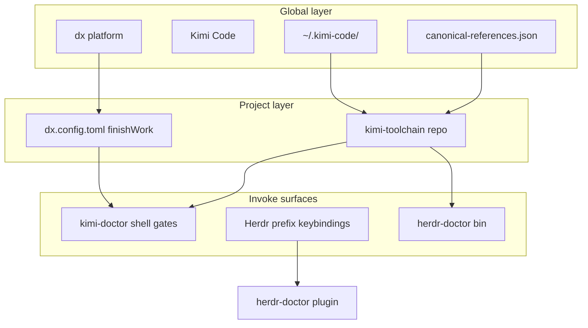

# Namespace boundary — toolchain vs Herdr plugins

Agents often conflate names that share a word (`doctor`, `orchestrator`) but live in different namespaces: **shell gate strings**, **toolchain CLIs**, **Herdr plugin actions**, and **Herdr UI keybindings**. See [Global / ecosystem](#global--ecosystem) for dx, Kimi Code, and the doctor trinity.

## Primary disambiguation table

| Namespace                     | What it is                                                                       | Binding / invoke                                        | Documented                                                                            |
| ----------------------------- | -------------------------------------------------------------------------------- | ------------------------------------------------------- | ------------------------------------------------------------------------------------- |
| `kimi-doctor`                 | Toolchain CLI — diagnostics, `--automation`, `--effect-gates`, finish-work gates | Shell: `kimi-doctor …` in `[finishWork].gates`          | [kimi-doctor.md](./kimi-doctor.md)                                                    |
| `herdr-doctor` (bin)          | Toolchain bin — DX/Herdr **integration health** for the config hub               | Shell: `herdr-doctor [--json] [--fix]`                  | `src/bin/herdr-doctor.ts`, [Doctor trinity](#doctor-trinity--kimi-code)               |
| `herdr-doctor` (plugin)       | **Herdr plugin** — sidebar pane, fleet/manifest status                           | Herdr UI: `prefix+d` → `herdr-doctor.status`            | Herdr plugin plan v0.5.0 (outside repo)                                               |
| `herdr-orchestrator` (CLI)    | Toolchain bin — dashboard server, `--probe`, context-sync                        | Shell: `herdr-orchestrator dashboard …`                 | `src/bin/herdr-orchestrator.ts`, [dashboard-thumbnails.md](./dashboard-thumbnails.md) |
| `herdr-orchestrator` (plugin) | **Herdr plugin** — remote agents, audit, GitHub link previews                    | Herdr UI: `prefix+a/l/f/t` + Control+click URLs         | Herdr plugin plan v0.5.0 (outside repo)                                               |
| `herdr-notify`                | **Herdr plugin** — Slack/Discord webhooks on agent events                        | Event hooks only (no finish-work gate)                  | Herdr plugin plan v0.5.0 (outside repo)                                               |
| `kimi-heal`                   | Toolchain CLI — Effect audit                                                     | Shell: `kimi-heal effect audit` in `[finishWork].gates` | `DEEP-QUALITY.md`, skills/effect-discipline                                           |

**Rule:** If the doc is under `docs/references/` in **this repo**, it describes **kimi-toolchain** behavior — not Herdr marketplace plugins unless explicitly labeled.

## Binding namespaces (no collision)

| Layer                       | Example                                                      | Config location                                                                                    |
| --------------------------- | ------------------------------------------------------------ | -------------------------------------------------------------------------------------------------- |
| **Finish-work shell gates** | `kimi-doctor --automation`, `kimi-heal effect audit`         | `dx.config.toml` `[finishWork].gates`                                                              |
| **Herdr plugin actions**    | `herdr-orchestrator.agent-start`, `herdr-doctor.status`      | `~/.config/herdr/config.toml` `[[keys.command]]`                                                   |
| **Orchestrator HTTP**       | `GET /api/meta`, `GET /api/thumbnail`                        | Co-located `Bun.serve` (see [dashboard-thumbnails.md](./dashboard-thumbnails.md))                  |
| **dx.config URL inventory** | `[[endpoints]]` rows (MCP, doc links) — not dashboard routes | `dx.config.toml`; pathname gate: `schemas/endpoints-strict.schema.toml` with `dx:table -u --exact` |

`prefix+d` in Herdr invokes the **plugin action** `herdr-doctor.status`. It does **not** run `kimi-doctor` from PATH.

## Toolchain integration vs Herdr plugin plan (v0.5.0)

The Herdr unified plugin plan (`herdr-orchestrator`, `herdr-doctor`, `herdr-notify` plugins) is **orthogonal** to kimi-toolchain finish-work gates.

| Concern                         | Status                                                                                              |
| ------------------------------- | --------------------------------------------------------------------------------------------------- |
| `kimi-doctor --automation` gate | Self-contained — no plugin link, SSH, or `notify.json`                                              |
| `[finishWork].gates`            | In-repo: `check:fast`, `--effect-gates`, `--automation`, `kimi-heal effect audit`                   |
| Plugin topology DAG             | Acyclic: core → plugins → STATE_DIR / CONFIG_DIR / SSH / GitHub — no back-edges                     |
| Keybinding namespace            | Herdr `prefix+*` ≠ shell gate strings                                                               |
| Effect-TS boundary              | Herdr plugins are L1/L2 Bun-native scripts; Effect enforcement stays in `kimi-doctor` / `kimi-heal` |

**Open plugin-plan gaps (8)** — scaffold, manifests, plugin link, notify config, keybindings, SSH, GitHub topic — are **not blockers** for `--automation` or finish-work. Soft overlap only: orchestrator plugin **dashboard pane** (optional Herdr UI for fleet data).

## Global / ecosystem

Layers above the plugin-vs-toolchain table. Sections above stay scoped to finish-work and Herdr plugins v0.5.0.

**Global boundary (manifest vs doc):** This file is indexed in `canonical-references.json` as a `localDocs` row — keys are `id`, `repoPath`, `runtimePath`, and `purpose` only (no `name`, unlike `ecosystem` entries). There is **no** corresponding key in `dx.config.toml`; gates and Herdr layout stay in `[finishWork]` / `[herdr]`. The manifest row points agents here; **this doc** describes doctor trinity, finish-work shell gates, and Herdr `prefix+*` keybindings — not the manifest schema itself.

Manifest id: `namespace` · repo: `docs/references/namespace.md` · runtime: `~/.kimi-code/docs/references/namespace.md`

### Platform and runtime home

| Layer              | What it is                                                         | Canonical path / invoke                    | Documented                                                |
| ------------------ | ------------------------------------------------------------------ | ------------------------------------------ | --------------------------------------------------------- |
| **dx**             | Global Bun dev/audit platform (separate codebase)                  | `~/.local/bin/dx`, `~/.config/dx/`         | `UNIFIED.md`, `~/.config/dx/AGENTS.md`, ecosystem id `dx` |
| **Kimi Code**      | Moonshot official agent CLI (Node SEA)                             | `kimi`, `~/.kimi-code/bin/kimi`            | `UNIFIED.md`, ecosystem id `kimi-code`                    |
| **~/.kimi-code/**  | Shared runtime home — Kimi Code data + synced toolchain extensions | `tools/`, `lib/`, `mcp.json`, `var/`       | `UNIFIED.md`, `AGENTS.md`                                 |
| **kimi-toolchain** | This repo — source of truth for Bun CLIs and sync                  | `~/kimi-toolchain/`                        | `AGENTS.md`, `UNIFIED.md`                                 |
| **Project config** | Per-repo gates and Herdr layout                                    | `dx.config.toml` `[finishWork]`, `[herdr]` | `docs/finish-work-close-loop.md`, `dx.config.toml`        |

### Ecosystem manifest

Authoritative link table for agents — **8 stacks** in `ecosystem`: `bun`, `effect`, `kimi-code`, `herdr`, `cloudflare`, `cloudflare-mcp`, `dx`, `oxc`.

- Repo: `canonical-references.json` (generate: `bun run references:generate`)
- Runtime copy: `~/.kimi-code/canonical-references.json`
- Source: `src/lib/canonical-references.ts`
- Probe embed: `kimi-doctor --probe` → `canonicalReferences`
- **11 `localDocs`** ids (including this file) in the same manifest under `localDocs`

### Herdr config symlink chain

Do not flatten — middle hop is intentional (`CODE_REFERENCES.md` § Herdr Config Symlink Chain):

```
~/.config/herdr/config.toml  →  ~/.config/dx/herdr.toml  →  ~/dx-config/config/dx/herdr.toml
```

| Hop   | Reads                         | Owns                                                                   |
| ----- | ----------------------------- | ---------------------------------------------------------------------- |
| Herdr | `~/.config/herdr/config.toml` | Herdr startup, `herdr server reload-config`, plugin `[[keys.command]]` |
| DX    | `~/.config/dx/herdr.toml`     | DX tooling, spawn wrappers, `herdr-project`                            |
| Git   | `~/dx-config/.../herdr.toml`  | Version-controlled dotfiles source                                     |

Runtime state (sockets, `session.json`) stays under `~/.config/herdr/` outside this chain.

### Doctor trinity (+ Kimi Code)

Four different “doctor” surfaces — same word, different products:

| Surface            | Kind                                      | One-line role                                                                     |
| ------------------ | ----------------------------------------- | --------------------------------------------------------------------------------- |
| **`kimi doctor`**  | Kimi Code official CLI                    | Moonshot agent config check — **not** `kimi-doctor`                               |
| **`kimi-doctor`**  | Toolchain CLI (`src/bin/kimi-doctor.ts`)  | Aggregator: `--automation`, `--effect-gates`, adapters, finish-work gates         |
| **`herdr-doctor`** | Toolchain bin (`src/bin/herdr-doctor.ts`) | DX/Herdr **integration health** for the config hub (`--json`, `--fix`)            |
| **`herdr-doctor`** | Herdr plugin (v0.5.0, outside repo)       | UI sidebar + `prefix+d` → `herdr-doctor.status` — **no shared code** with the bin |

`prefix+d` and `[finishWork].gates` never invoke the same executable.

### Doctor plugin scope (kimi-doctor extensions)

Optional subprocess plugins for `kimi-doctor` (not the Herdr plugin above):

| Scope         | Path                               | Precedence             |
| ------------- | ---------------------------------- | ---------------------- |
| Project-local | `.kimi/doctor-plugins.json`        | Wins on name collision |
| User-global   | `~/.kimi-code/doctor-plugins.json` | Fallback               |

Each entry: `name` + `command`; stdout JSON `{ "checks": [...] }`. See `CODE_REFERENCES.md` § Doctor plugins.



## Practical `@see` ladder

Pick the **lowest rung that fully answers the question** — do not jump to this doc when `@see dx` suffices; escalate when the same word names different executables.

| Intent                           | Minimal `@see`                                 | Resolves to                                                                 |
| -------------------------------- | ---------------------------------------------- | --------------------------------------------------------------------------- |
| Global platform / project config | `@see dx`                                      | `~/.config/dx/AGENTS.md` · ecosystem id `dx` in `canonical-references.json` |
| Gate strings in `[finishWork]`   | `@see docs/references/kimi-doctor.md`          | Shell gates only — not Herdr `prefix+d`                                     |
| Doctor / orchestrator name clash | `@see docs/references/namespace.md`            | Trinity + binding layers (this doc)                                         |
| Thumbnail encode path            | `@see docs/references/dashboard-thumbnails.md` | `Bun.Image` terminals · `/api/thumbnail`                                    |
| Endpoint table validation        | `@see schemas/endpoints-strict.schema.toml`    | `dx:table -u --exact` · not dashboard HTTP                                  |

**Doc links in `src/**/\_.ts`:** executable code must use registered `BUN\_\_\_DOC_URL` constants (`bun run lint:doc-links`). JSDoc `@see`with`bun.com`deep links is exempt from`use-doc-constant`; absolute `https://bun.sh/docs…` in comments still flags under `prefer-bun-com-docs` — migrate to `bun.com`.

Related commands: `bun run dx:table -u`, `bun run dx:table:contract`, `bun run references:generate`, `kimi-doctor --probe`.

## Related docs

### `docs/references/` index (5 `localDocs`)

Agent-indexed reference docs in this directory — synced to `~/.kimi-code/docs/references/` after `bun run sync`. SSOT rows: `src/lib/canonical-references.ts` → `canonical-references.json`.

| Manifest id            | File                                                 | One-line                                                                          |
| ---------------------- | ---------------------------------------------------- | --------------------------------------------------------------------------------- |
| `namespace`            | [namespace.md](./namespace.md)                       | Toolchain vs Herdr plugin boundaries; doctor trinity; global ecosystem (this doc) |
| `kimi-doctor`          | [kimi-doctor.md](./kimi-doctor.md)                   | `kimi-doctor --automation` gate — CLI, JSON schema, exit codes                    |
| `dashboard-thumbnails` | [dashboard-thumbnails.md](./dashboard-thumbnails.md) | WebView screenshot → `Bun.Image` terminals → `/api/thumbnail`                     |
| `shell-spawn-choice`   | [shell-spawn-choice.md](./shell-spawn-choice.md)     | `invokeTool` vs `Bun.spawn` vs `governedSpawn`                                    |
| `bun-shell-companions` | [bun-shell-companions.md](./bun-shell-companions.md) | Bun `$` template vs subprocess; inspect companions                                |

| Topic                                 | Path                                                           |
| ------------------------------------- | -------------------------------------------------------------- |
| Automation gate CLI + JSON            | [kimi-doctor.md](./kimi-doctor.md)                             |
| Thumbnail encode + WebView consumer   | [dashboard-thumbnails.md](./dashboard-thumbnails.md)           |
| Finish-work pipeline order            | `docs/finish-work-close-loop.md`                               |
| Deprecated flags / legacy naming      | `docs/naming.md`                                               |
| Kimi Code vs toolchain matrix         | `UNIFIED.md`                                                   |
| Ecosystem link manifest               | `canonical-references.json`, `src/lib/canonical-references.ts` |
| Config symlink chain + doctor plugins | `CODE_REFERENCES.md`                                           |
