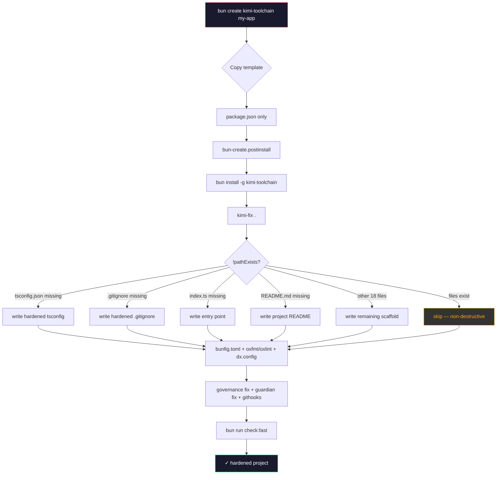

# Template Families Matrix

## Overview

| Family | Files | Generated By | Runtime Sync Target | Overwrite Policy | Collision Risk |
|---|---|---|---|---|---|
| **bun-create** | 1 | `bun create kimi-toolchain` | `~/.bun-create/kimi-toolchain/` | N/A (template source) | Low — postinstall orchestrates |
| **scaffold** | 22 | `kimi-fix <path>` | Project root (`./`) | Non-destructive (`!pathExists`) | **High** with `bun init` — mitigated by `-m` |
| **desktop-runtime** | 1 | `bun run sync` | `~/.kimi-code/` | Merge (JSON + MD overwrite) | None — separate namespace |
| **other** | 4 | Manual / Herdr dashboard | `docs/herdr/` + `docs/mcp/` | Manual | None |

**Consumed by:** `kimi-fix`, Herdr orchestrator, `LOCAL_DOC_REFERENCES`, `sync-verify.ts`, `bun create kimi-toolchain`

---

## Scaffold Breakdown (22 files)

### Config Layer (7 files)

| File | Purpose | Profile | Defining Module | bun init Collision? |
|---|---|---|---|---|
| `bunfig.toml` | Bun runtime config (registry, preload, test runner) | Both | `kimi-fix.ts` | **Yes** — `-m` skips |
| `tsconfig.json` | Hardened TypeScript (strict, paths, Bun types) | Both | `kimi-fix.ts` | **Yes** — `-m` skips |
| `oxfmtrc.json` | oxformat config | Both | `kimi-fix.ts` | No |
| `oxlintrc.json` | oxlint rules | Both | `kimi-fix.ts` | No |
| `dx.config.app.toml` | Herdr + finish-work gates (app profile) | App | `kimi-fix.ts` | No |
| `dx.config.toolchain.toml` | Herdr + finish-work + toolchain extras | Toolchain | `kimi-fix.ts` | No |
| `ci.yml` | GitHub Actions workflow | Both | `kimi-fix.ts` | No |

### Docs Layer (5 files)

| File | Purpose | Profile | Defining Module | Runtime Path |
|---|---|---|---|---|
| `README.md` | Project quickstart, badges, name | Both | `kimi-fix.ts` | `./README.md` |
| `adr-template.md` | Architecture Decision Record template | Both | `kimi-fix.ts` | `./docs/adr/0001-*.md` |
| `code-references.md` | Cross-ref conventions, `@see` ladder | Both | `kimi-fix.ts` | `./docs/references/` |
| `skills-readme.md` | Agent skill loading guide | Toolchain | `kimi-fix.ts` | `./skills/*/SKILL.md` |
| `LICENSE-MIT` | License stub | Both | `kimi-fix.ts` | `./LICENSE` |

### Source Layer (4 files)

| File | Purpose | Profile | Defining Module | Entry Point? |
|---|---|---|---|---|
| `index.ts` | Minimal Bun HTTP server (port 0 auto-assign) | Both | `kimi-fix.ts` | **Yes** — `bun run start` |
| `bun-globals.d.ts` | Global type augmentations | Both | `kimi-fix.ts` | No |
| `env.example` | Environment variable template | Both | `kimi-fix.ts` | No |
| `gitignore` | Ignore patterns (node_modules, dist, .env) | Both | `kimi-fix.ts` | **Yes** — `bun init` creates basic version |

### Scripts Layer (6 files)

| Script | Purpose | Profile | Injected By | package.json Script |
|---|---|---|---|---|
| `finish-work.ts` | Finish-work pipeline runner | Toolchain | `kimi-fix.ts` | `finish-work` |
| `finish-work-config.ts` | Finish-work configuration | Toolchain | `kimi-fix.ts` | — |
| `finish-work-herdr.ts` | Herdr integration for finish-work | Toolchain | `kimi-fix.ts` | — |
| `reviewer-pane.ts` | Review pane helper | Toolchain | `kimi-fix.ts` | — |
| `lib/bun-io.ts` | Bun-native I/O utilities | Toolchain | `kimi-fix.ts` | — |
| `lib/bun-utils.ts` | Bun API facade (gzip, exec, UUID v7) | Toolchain | `kimi-fix.ts` | — |

> **Quality gate scripts** (`check.ts`, `run-tests.ts`, `readme-sync.ts`, `test-gates.ts`, `lint-banned-terms.ts`) are injected by `kimi-fix` from the toolchain's `scripts/` directory, not the scaffold template directory. The run-tests.ts wrapper supports `--parallel[=N]` (Bun ≥1.3.13, all CPUs with work-stealing) and `--shard=M/N` (CI matrix splitting).

> **Note:** Quality gate scripts (`check.ts`, `run-tests.ts`, `readme-sync.ts`, `test-gates.ts`, `lint-banned-terms.ts`) are generated by `kimi-fix` from the toolchain's `scripts/` directory, not the scaffold template directory. They are listed here for completeness but sourced from the runtime toolchain, not `templates/scaffold/`.

---

## Bridge Pattern: Collision Resolution

| Step | Tool | Files Created | Collision Files | Mitigation |
|---|---|---|---|---|
| 1 | `bun init -m -y` | `package.json`, `node_modules/`, `bun.lockb` | None (minimal mode) | `-m` skips `tsconfig.json`, `README.md`, `index.ts`, `.gitignore` |
| 2 | `kimi-fix .` | All 22 scaffold files | `tsconfig.json`, `.gitignore`, `index.ts`, `README.md` | `!pathExists()` guard in `kimi-fix.ts` (non-destructive). Field is already clear because `-m` skipped the four files. |
| 3 | `bun run check:fast` | Validation only | None | Confirms scaffold integrity |



> **Why this order matters:** The `-m` flag is the only thing that keeps `bun init` from fighting `kimi-fix` over `tsconfig.json`, `index.ts`, `.gitignore`, and `README.md`. Without it, `bun init` creates basic versions first, and `kimi-fix`'s `!pathExists()` guard skips them — leaving the project with Bun's defaults instead of the hardened toolchain versions.

---

## Runtime Sync Matrix

| Source | Destination | Trigger | Files |
|---|---|---|---|
| `docs/references/*.md` | `~/.kimi-code/docs/references/` | `bun run sync` | `namespace.md`, `kimi-doctor.md`, `bun-runtime-scaffold.md`, etc. |
| `canonical-references.json` | `~/.kimi-code/` | `bun run sync` | Single JSON manifest |
| `skills/*/SKILL.md` | `~/.kimi-code/skills/` | `bun run sync` | 7 agent runbooks |
| `templates/scaffold/` | Project root (on `kimi-fix`) | `kimi-fix <path>` | 22 files per project |
| `templates/bun-create/` | `~/.bun-create/` (install-time) | `bun install -g` | 1 template package |

---

## Profile Diff (app vs toolchain)

| File | App | Toolchain | Delta |
|---|---|---|---|
| `dx.config.toml` | 12 gates | 18 gates | +Herdr, +effect-gates, +finish-work |
| `scripts/finish-work.ts` | ❌ | ✅ | Runtime close-loop only |
| `scripts/reviewer-pane.ts` | ❌ | ✅ | Cross-pane review |
| `scripts/lib/bun-io.ts` | ❌ | ✅ | Bun-native I/O utilities |
| `scripts/lib/bun-utils.ts` | ❌ | ✅ | Bun API facade |
| `skills-readme.md` | ❌ | ✅ | Agent runbook index |
| `index.ts` | Basic HTTP | +WebSocket +metrics | Dashboard hooks |

---

## Which tool do I use?

| Scenario | Command | Family |
|---|---|---|
| New project from template | `bun create kimi-toolchain` | bun-create |
| Harden existing repo | `kimi-fix .` | scaffold |
| Add missing scripts to project | `kimi-fix . --profile app` | scaffold |
| Create toolchain workspace | `kimi-fix . --profile toolchain` | scaffold |
| Sync docs to agent runtime | `bun run sync` | desktop-runtime |

---

## Error Scenarios

| Mistake | Symptom | Fix |
|---|---|---|
| `bun init` without `-m` | `tsconfig.json` is basic (`module: "Preserve"`), not hardened (`module: "ESNext"`) | `rm tsconfig.json && kimi-fix .` |
| `kimi-fix` after full `bun init` | `!pathExists()` skips `tsconfig.json`, `.gitignore`, `index.ts`, `README.md` | `rm tsconfig.json .gitignore src/index.ts README.md && kimi-fix .` |
| Missing `bun run sync` | `kimi-doctor --probe` shows 13 localDocs, not 14 | `bun run sync && bun run sync:verify` |
| `bun create` template has deps | npm client (pnpm/yarn) runs install, not Bun | Remove `dependencies` from template `package.json` |
| Canvases not synced | Hover info stale in IDE | `bun run scripts/lint-cursor-canvas.ts` |

---

## Verification Gate

```bash
# After kimi-fix on a fresh project
bun run check:fast        # Typecheck + lint + unit tests
kimi-doctor --scaffold    # All scaffold checks pass
bun run sync:verify       # Runtime paths match repo paths
```

| Check | Expected | Failure Mode |
|---|---|---|
| `localDocsCount` | 14 | Missing `template-matrix` in `LOCAL_DOC_REFERENCES` |
| `scaffoldFiles` | 22 | `kimi-fix` skipped due to `pathExists` |
| `collisionRisk` | 0 | `bun init` ran without `-m` |
| `bunfig.toml` | `linker = "isolated"`, `globalStore = true` | Template stale or overwritten |

---

## Skill Mapping

| Skill | Consumes | Why |
|---|---|---|
| `kimi-toolchain` | scaffold, bun-create | Project bootstrap and health |
| `create-template` | scaffold, bun-create | Template authoring and registration |
| `herdr` | scaffold (`dx.config.*.toml`) | Workspace orchestration |
| `orchestrator` | desktop-runtime, other | Dashboard + MCP bridge |
| `finish-work` | scaffold (scripts) | Gate execution |
| `effect-discipline` | scaffold (`check.ts`) | Effect audit in `check:fast` |

---

## Changelog

| Date | Change | Breaking? |
|---|---|---|
| 2026-06-18 | Added `template-matrix.md` | No — new doc |
| 2026-06-18 | `bun-runtime-scaffold.md` added | No — new doc |
| 2026-06-18 | `bun create kimi-toolchain` template | No — new scaffold path |
| 2026-06-18 | `health-channel.ts` cross-tool telemetry | No — new module |
| 2026-06-17 | `bun init -m` bridge pattern documented | No — template postinstall only |

---

## File Count Summary

| Category | Count | % of Scaffold |
|---|---|---|
| Config | 7 | 31.8% |
| Docs | 5 | 22.7% |
| Source | 4 | 18.2% |
| Scripts | 6 | 27.3% |
| **Total Scaffold** | **22** | **100%** |
| bun-create template | 1 | — |
| desktop-runtime | 1 | — |
| Herdr dashboard + MCP | 4 | — |
| **Grand Total** | **28** | — |

## Related

| Topic | Path |
|-------|------|
| Configuration layers model | [configuration-layers.md](./configuration-layers.md) |
| Bun runtime scaffold flags | [bun-runtime-scaffold.md](./bun-runtime-scaffold.md) |
| Scaffold templates | `templates/scaffold/` |
| `bun create` template | `templates/bun-create/kimi-toolchain/` |
| `kimi-fix` source | `src/bin/kimi-fix.ts` |
