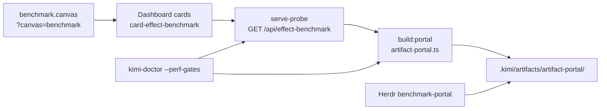

# Artifact Portal — Canvas → Probe → Herdr → Artifact

How benchmark diagnostics converge across IDE canvas companions, the examples dashboard, serve-probe, and Herdr into one persisted artifact gate.

Related: [control-plane-layers.md](control-plane-layers.md), [artifact-dependency-graphs.md](artifact-dependency-graphs.md), [docs/references/serve-probe.md](../docs/references/serve-probe.md).

## The problem this solves

Before convergence, each surface ran its own benchmark loop. Canvas cards, dashboard probes, and CLI gates could drift. The portal pattern pulls **one envelope** (`BenchmarkApiEnvelope`) and registers it where agents and dashboards can query lineage.

## Convergence map



| Surface        | Role                                      | SSOT module                          |
| -------------- | ----------------------------------------- | ------------------------------------ |
| Canvas         | Deep-link filter for benchmark cards      | `src/canvases/benchmark.manifest.ts` |
| Dashboard      | Live probe + refresh routes               | `src/lib/card-probe-server.ts`       |
| serve-probe    | Read-only `BenchmarkApiEnvelope` HTTP API | `GET /api/effect-benchmark`          |
| serve-probe    | Read-only `ConfigStatusReport` HTTP API   | `GET /api/config-status`             |
| CLI / loop     | Offline fallback runner                   | `runEffectBenchmarkCardLoop()`       |
| CLI / loop     | Offline config-status audit               | `auditConfigLayersStatus()`          |
| Portal publish | Persist diagnostics + manifest            | `src/lib/artifact-portal.ts`         |
| Herdr          | Workspace plugin action                   | `herdr-plugin/benchmark-portal.ts`   |

Contract declaration: `contracts/artifact-portal.json`.

## Converged components

All three consumers feed the same `BenchmarkApiEnvelope` — no parallel benchmark loops:

| Component     | SSOT                                                  | Emission path                                                     |
| ------------- | ----------------------------------------------------- | ----------------------------------------------------------------- |
| **Canvas**    | `src/canvases/benchmark.manifest.ts`                  | Deep-link influences; envelope stamped via `metadata.convergence` |
| **Dashboard** | `examples/dashboard/src/handlers/effect-benchmark.ts` | `runEffectBenchmarkCardLoop({ runner: "dashboard" })`             |
| **Herdr**     | `herdr-plugin/benchmark-portal.ts`                    | `buildArtifactPortal()` — same as `bun run build:portal`          |

Serve-probe aggregates dashboard card probe state into the envelope (`metadata.convergence.dashboardProbe`). The portal manifest lists `convergedComponents: ["canvas","dashboard","herdr"]` after every `build:portal` run.

**Bun `--changed` import-graph mechanics** are stamped on the same envelope as `metadata.testExecution.changedImportGraph` (SSOT: `BUN_TEST_CHANGED_IMPORT_GRAPH` in `src/lib/test-runtime.ts`). They are **not** a separate portal artifact — read them from the benchmark diagnostics JSON or live `GET /api/effect-benchmark`. The dashboard card `card-bun-test` mirrors the same payload at `GET /api/bun-test`.

```bash
bun run build:portal --local-only
bun run test:portal-convergence   # asserts converged manifest + envelope metadata
```

## One-command demo

```bash
# Runnable example (recommended first run)
cd examples/portal && bun run portal:local

# Repo root equivalent
bun run build:portal --local-only

# Smoke test
bun run test:portal-convergence
```

With dashboard running:

```bash
PORT=5678 bun run dashboard -- --daemon --port=5678
bun run build:portal
curl -s http://127.0.0.1:5678/api/effect-benchmark | jq '.runner, .gates.effectBenchmarkGate'
curl -s http://127.0.0.1:5678/api/effect-benchmark | jq '.metadata.testExecution.changedImportGraph.title'
open 'http://127.0.0.1:5678/?example=portal&canvas=benchmark#card-bun-test'
```

## What lands on disk

```
.kimi/artifacts/artifact-portal/
├── <timestamp>-benchmark-diagnostics.json    # BenchmarkApiEnvelope (+ metadata.testExecution.changedImportGraph)
├── <timestamp>-config-status-diagnostics.json # ConfigStatusReport from serve-probe or local audit
└── <timestamp>-artifact-portal-manifest.json  # portal index (paths, contract, source, configStatus)
```

Inspect:

```bash
kimi-doctor --artifacts-list artifact-portal
kimi-doctor --artifacts-latest artifact-portal --json
```

## Envelope sources

| `benchmark.source` | When                                         |
| ------------------ | -------------------------------------------- |
| `serve-probe`      | Dashboard probe reachable at resolve URL     |
| `local-loop`       | Probe offline or `build:portal --local-only` |

Both paths register the same gate (`artifact-portal`) and canvas influences (`card-effect-benchmark`, `card-perf-harness`, `card-kimi-doctor`, `card-config-status`). `build:portal` emits two diagnostic artifacts: benchmark diagnostics and config-status diagnostics.

## Agent checklist

1. `cd examples/portal && bun run portal:local` — confirm artifacts exist.
2. `bun run verify` — convergence unit smoke passes.
3. Optional: start dashboard, `bun run portal`, compare probe JSON to saved artifact.
4. Deep link: `http://127.0.0.1:5678/?example=portal&canvas=benchmark`.
5. In-repo: `bun run test:portal-convergence` before push (or rely on `kimi-githooks`). Standalone slices: `bun run hooks:install`.

## Hooks — what runs where

Git hooks are **per-repo** (one `.git/hooks/` for all of kimi-toolchain). Three layers — do not mix them up:

| Layer             | Install                                  | On `git commit`                                                              | On `git push`                                                                                                                          |
| ----------------- | ---------------------------------------- | ---------------------------------------------------------------------------- | -------------------------------------------------------------------------------------------------------------------------------------- |
| **kimi-githooks** | `kimi-githooks install`                  | format + lint + typecheck on **staged** files; `test:changed` or `test:fast` | guardian, effect-gates, R-Score, `check:fast:skip-tests` (format/lint/tsc **no tests** by default), sync — see `src/lib/hook-gates.ts` |
| **Portal guard**  | `hooks:install` in standalone slice only | **nothing** (removes pre-commit if present)                                  | `build:portal --local-only` + `jq` only (~5s) — **no** `bun test`, **no** format                                                       |
| **Manual**        | —                                        | —                                                                            | `bun run test:portal-convergence` when you want the smoke file                                                                         |

`kimi-githooks` pre-push does **not** run the full unit suite by default (`check:fast:skip-tests`). Set `KIMI_PRE_PUSH_TESTS=1` to add tests; `KIMI_PRE_PUSH_FULL=1` for full `check`.

Portal tests are **not** repo-wide:

```bash
bun run test:portal-convergence:fast   # one mocked serve-probe test (~100ms)
bun run test:portal-convergence        # + slow local-loop integration (~5s, runs effect benchmark loop once)
```

The local-loop test exercises `runEffectBenchmarkCardLoop()` (discovers registered effect handlers — feels like “the whole repo” but it is one orchestration pass, not `bun test` of every file). The portal **hook** no longer runs either test — only `build:portal --local-only`.

## Pre-push guard (convergence only)

Portal templates and workspaces install **only** the convergence pre-push guard. Format, typecheck, guardian, and other gates belong to `kimi-githooks` in the parent repo — not in spawned portal slices.

`scripts/pre-push-portal.sh` keeps the convergence contract honest on every push — fast, deterministic, no network jitter.

| Step | What runs                                 | Why                                                                                 |
| ---- | ----------------------------------------- | ----------------------------------------------------------------------------------- |
| 1    | `build:portal --local-only --json` + `jq` | `converged: true`, components `canvas` + `dashboard` + `herdr`, `source=local-loop` |

Always `--local-only` — no dashboard, no `bun test`, no format/lint. Optional manual smoke: `bun run test:portal-convergence:fast`.

**Install (standalone portal slice only):**

```bash
bun run hooks:install    # bun-create artifact-portal-convergence workspace
```

Inside **kimi-toolchain**, `hooks:install` is a no-op (shared `.git/hooks` — installing would clobber `kimi-githooks`). Use `bun run test:portal-convergence` or `kimi-githooks install` for full policy.

When install runs (standalone clone), it symlinks **only** `.git/hooks/pre-push` and **removes** pre-commit, commit-msg, and other hooks so format/typecheck never run from portal slices.

Hook resolves the repo root via `scripts/resolve-repo-root.sh` (Cursor worktree-safe) and follows symlinks when installed under `.git/hooks/`. Typical runtime: ~10s (well under the 50s hook budget).

## Scaffold & templates

| Artifact               | Path                                                | Purpose                                                   |
| ---------------------- | --------------------------------------------------- | --------------------------------------------------------- |
| Manifest types         | `templates/artifact-portal/index.ts`                | `buildPortalManifestPayload`, `convergedComponents` shape |
| Runnable example       | `examples/portal/`                                  | Thin wrapper — `portal:local`, `verify`, `hooks:install`  |
| `bun create` workspace | `templates/bun-create/artifact-portal-convergence/` | Spawn a convergence workspace inside the repo             |

**Spawn a convergence workspace** (must live inside the kimi-toolchain git tree):

```bash
bun create ./templates/bun-create/artifact-portal-convergence my-portal-workspace
cd my-portal-workspace
bun run portal:local    # one command → diagnostics + manifest on disk
bun run verify          # convergence smoke
bun run hooks:install   # pre-push guard
```

The template delegates to repo-root scripts (`build-portal.ts`, `test/portal-convergence.unit.test.ts`) via thin `scripts/*.sh` wrappers. Set `KIMI_PROJECT_ROOT` when the git toplevel is not the canonical clone.

Extend with additional diagnostic types by registering new `registerPortalArtifact()` entries — keep one envelope schema per diagnostic surface.
## Related

- [INDEX.md](../INDEX.md) — Documentation index
