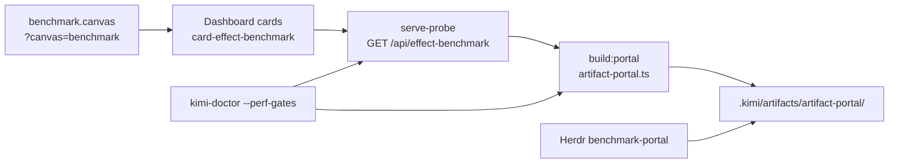

# Artifact Portal — Canvas → Probe → Herdr → Artifact

How benchmark diagnostics converge across IDE canvas companions, the examples dashboard, serve-probe, and Herdr into one persisted artifact gate.

Related: [control-plane-layers.md](control-plane-layers.md), [artifact-dependency-graphs.md](artifact-dependency-graphs.md), [docs/references/serve-probe.md](../docs/references/serve-probe.md).

## The problem this solves

Before convergence, each surface ran its own benchmark loop. Canvas cards, dashboard probes, and CLI gates could drift. The portal pattern pulls **one envelope** (`BenchmarkApiEnvelope`) and registers it where agents and dashboards can query lineage.

## Convergence map



| Surface        | Role                                      | SSOT module                          |
| -------------- | ----------------------------------------- | ------------------------------------ |
| Canvas         | Deep-link filter for benchmark cards      | `src/canvases/benchmark.manifest.ts` |
| Dashboard      | Live probe + refresh routes               | `src/lib/card-probe-server.ts`       |
| serve-probe    | Read-only `BenchmarkApiEnvelope` HTTP API | `GET /api/effect-benchmark`          |
| CLI / loop     | Offline fallback runner                   | `runEffectBenchmarkCardLoop()`       |
| Portal publish | Persist diagnostics + manifest            | `src/lib/artifact-portal.ts`         |
| Herdr          | Workspace plugin action                   | `herdr-plugin/benchmark-portal.ts`   |

Contract declaration: `contracts/artifact-portal.json`.

## Converged components

All three consumers feed the same `BenchmarkApiEnvelope` — no parallel benchmark loops:

| Component     | SSOT                                                  | Emission path                                                     |
| ------------- | ----------------------------------------------------- | ----------------------------------------------------------------- |
| **Canvas**    | `src/canvases/benchmark.manifest.ts`                  | Deep-link influences; envelope stamped via `metadata.convergence` |
| **Dashboard** | `examples/dashboard/src/handlers/effect-benchmark.ts` | `runEffectBenchmarkCardLoop({ runner: "dashboard" })`             |
| **Herdr**     | `herdr-plugin/benchmark-portal.ts`                    | `buildArtifactPortal()` — same as `bun run build:portal`          |

Serve-probe aggregates dashboard card probe state into the envelope (`metadata.convergence.dashboardProbe`). The portal manifest lists `convergedComponents: ["canvas","dashboard","herdr"]` after every `build:portal` run.

```bash
bun run build:portal --local-only
bun run test:portal-convergence   # asserts converged manifest + envelope metadata
```

## One-command demo

```bash
# Runnable example (recommended first run)
cd examples/portal && bun run portal:local

# Repo root equivalent
bun run build:portal --local-only

# Smoke test
bun run test:portal-convergence
```

With dashboard running:

```bash
PORT=5678 bun run dashboard -- --daemon --port=5678
bun run build:portal
curl -s http://127.0.0.1:5678/api/effect-benchmark | jq '.runner, .gates.effectBenchmarkGate'
```

## What lands on disk

```
.kimi/artifacts/artifact-portal/
├── <timestamp>-benchmark-diagnostics.json   # BenchmarkApiEnvelope payload
└── <timestamp>-artifact-portal-manifest.json # portal index (paths, contract, source)
```

Inspect:

```bash
kimi-doctor --artifacts-list artifact-portal
kimi-doctor --artifacts-latest artifact-portal --json
```

## Envelope sources

| `benchmark.source` | When                                         |
| ------------------ | -------------------------------------------- |
| `serve-probe`      | Dashboard probe reachable at resolve URL     |
| `local-loop`       | Probe offline or `build:portal --local-only` |

Both paths register the same gate (`artifact-portal`) and canvas influences (`card-effect-benchmark`, `card-perf-harness`, `card-kimi-doctor`).

## Agent checklist

1. `cd examples/portal && bun run portal:local` — confirm artifacts exist.
2. `bun run verify` — convergence unit smoke passes.
3. Optional: start dashboard, `bun run portal`, compare probe JSON to saved artifact.
4. Deep link: `http://127.0.0.1:5678/?example=portal&canvas=benchmark`.

## Scaffold

Portal manifest template: `templates/artifact-portal/index.ts`. Extend with additional diagnostic types by registering new `registerPortalArtifact()` entries — keep one envelope schema per diagnostic surface.
